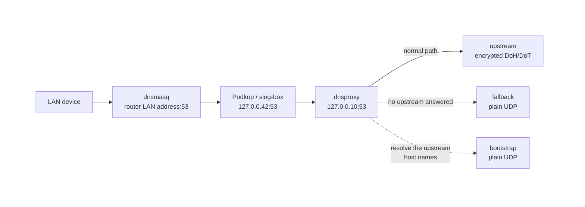

# Podkop Subscriptions

An OpenWrt add-on for [Podkop](https://github.com/itdoginfo/podkop). It downloads proxy links from HTTP/HTTPS subscriptions, filters them, validates them against Podkop/sing-box, and writes the resulting list into a chosen section of `/etc/config/podkop`.

The guiding principle is **never break a working configuration**. If a subscription fails to load, returns an empty response, or serves broken links, the current Podkop section is left untouched.

[Русская версия](README_RU.md) · [Changelog](CHANGELOG.md)

---

## Update links right now

The command you will use most. It downloads the subscriptions, filters, validates, and writes links into Podkop — and **prints the whole log straight to the terminal**, so you can see exactly what happens at every step:

```sh
/usr/bin/podkop-sub-updater.py --subs /etc/config/podkop_subscriptions --config /etc/config/podkop --force
```

It is synchronous: it blocks until finished and returns an exit code. This is the command to use for the first setup and for investigating any problem.

Typical output (the program logs in Russian):

```text
[INFO] === ЗАПУСК ОБНОВЛЕНИЯ ПОДПИСОК ===
[INFO] Профиль запроса подписок: v2raytun/android, Android, Android 11, OnePlus MT2110; ...
[INFO] источник 1: попытка 1/3, timeout=45s
[INFO] источник 1: успешно загружен с попытки 1/3
[INFO] [main]: источник 1 (base64) -> ссылок после фильтра: 96
[INFO] [main]: Дубликатов в новых ссылках подписки отброшено: 4
[INFO] [main]: Итого уникальных новых ссылок из внешних подписок: 92
[INFO] [main]: для совместимости с Podkop добавлен type=tcp в ключах: 4
[INFO] [main]: проверка совместимости Podkop/sing-box: принято 75, отброшено 0, sing-box check запусков: 2
[INFO] [main]: limit max_links=50, current=48, new_candidates=75, potential=80
[INFO] [main]: итог: добавлено=6, удалено=2, дубликатов в текущем конфиге=0, ключей итого=50
[INFO] Успешно завершено: конфиг обновлён, Podkop перезапущен.
```

These lines show precisely where links are lost: fetching a source, the regex filter, deduplication, the compatibility check, or the `max_links` cap.

Subscription URLs and proxy links are replaced with `<remote-url>` and `<proxy-link>` in the output, and parameters such as `sni=`, `uuid=`, `password=` become `<hidden>`. Sources are labelled `источник 1`, `источник 2`, and `локальный список`. The log is safe to share and to attach to an issue as is.

### If you want a background run

`/usr/bin/podkop-sub-run-now` performs the same cycle in the background, writing to `/tmp/podkop-sub-updater.log`. It exists so the **Запустить updater** button in LuCI can report a result. From a console it is rarely worth it: you have to chase the output with `tail -f`. See [All commands](#all-commands) for details.

---

## Quick start

The steps are in the order you actually perform them on a fresh router.

### Step 1. Install

Interactive installer — asks about the LuCI panel and about creating a config:

```sh
wget -O /tmp/podkop-sub-install.sh https://raw.githubusercontent.com/makxis/podkop-subscriptions/main/install.sh && sh /tmp/podkop-sub-install.sh
```

Unattended, with the LuCI panel (recommended if unsure):

```sh
wget -O /tmp/podkop-sub-install.sh https://raw.githubusercontent.com/makxis/podkop-subscriptions/main/install.sh && sh /tmp/podkop-sub-install.sh --remote --with-panel --no-config
```

With `--no-config` an existing config is never rewritten; if none exists, a disabled example is created that you can then edit in LuCI.

### Step 2. Configure subscriptions

**Via LuCI** (if installed with the panel):

```text
Services → Подписки Podkop
```

Set the target Podkop section and the subscription URLs, then press **Save & Apply**.

Save & Apply only stores settings — it does not fetch links yet.

> The LuCI page, the status line, and the log messages are currently Russian-only. This README translates them where they are quoted.

**Via SSH** — edit the config:

```sh
vi /etc/config/podkop_subscriptions
uci commit podkop_subscriptions && reload_config
```

`reload_config` is required here: without it the schedule is saved but never reaches cron.

A minimal working example is in [Configuration](#configuration).

### Step 3. Fetch links for the first time

```sh
/usr/bin/podkop-sub-updater.py --subs /etc/config/podkop_subscriptions --config /etc/config/podkop --force
```

Seeing the full output matters most on the first run: it immediately tells you whether the sources are reachable, whether the regex filter cuts too much, and how many links actually reached Podkop.

In LuCI the same thing is done by the **Запустить updater** button at the bottom of the page, but its output goes to the log file. Until the first run, the page shows a first-time-setup hint instead of a status.

### Step 4. Check the result

```sh
/usr/bin/podkop-sub-updater.py --status-summary
```

A healthy status line looks like this (output is Russian):

```text
Состояние: OK — обновлено: 2026-05-31 23:49, источники: 3/3, ключей в секции: 75,
рабочих: нет данных, удалено: 0, локальных: 2, автообновление: включено.
```

Confirm the links really landed in Podkop:

```sh
grep -c "proxy_string" /etc/config/podkop
```

### Step 5. Clean up installation leftovers

```sh
/usr/bin/podkop-sub-clean-temp
```

Removes downloaded archives, unpacked directories, and the LuCI cache. Configs, local links, `state.json`, backups, and the last run log are kept.

### Step 6 (later). Update the software itself

```sh
wget -O /tmp/podkop-sub-upgrade.sh https://raw.githubusercontent.com/makxis/podkop-subscriptions/main/install.sh && sh /tmp/podkop-sub-upgrade.sh --remote --with-panel --no-config && /usr/bin/podkop-sub-clean-temp
```

`/etc/config/podkop_subscriptions`, local links, and `state.json` are preserved.

---

## Tested with

```text
OpenWrt:         24.10.3–24.10.6; 25.12.4
Podkop:          v0.7.17–v0.7.19
LuCI App Podkop: v0.7.17–v0.7.19
sing-box:        1.12.17; 1.12.22
```

## Features

- downloads plain-text and base64 subscriptions;
- supports `vless://`, `trojan://`, `ss://`, `socks4://`, `socks4a://`, `socks5://`, `hy2://`, `hysteria2://`;
- validates links with a Python checker and `sing-box check` **before** writing to Podkop;
- never overwrites a working section when no valid links remain;
- filters links with a regular expression;
- collapses SNI rotations and `IP/domain:port` duplicates;
- tracks `fail_count` for links that stay dead and can prune them;
- caps the number of links and drops high-latency ones;
- supports a protected local link list;
- works over SSH/cron with no LuCI at all;
- rebuilds cron automatically after Apply in LuCI (and on `reload_config`);
- catches up on missed updates after long router downtime;
- guards every execution path with a shared file lock.

---

## All commands

### Everyday

| Command | What it does |
|---|---|
| `/usr/bin/podkop-sub-updater.py --subs /etc/config/podkop_subscriptions --config /etc/config/podkop --force` | **Update links now.** The full cycle (download → filter → validate → write to Podkop), synchronously, with the whole log on the terminal and an exit code at the end. The main tool both for first setup and for troubleshooting. |
| `/usr/bin/podkop-sub-run-now` | The same cycle in the background, logging to `/tmp/podkop-sub-updater.log`. Needed by the LuCI button; from a console it only helps if you do not want to wait. Silently skips if the updater is already running. |
| `/usr/bin/podkop-sub-run-now --status` | Background-run state: `running` / `finished` / `idle`, plus the tail of the log. |
| `/usr/bin/podkop-sub-run-now --version` | Installed version. |
| `/usr/bin/podkop-sub-updater.py --status-summary` | One-line status for LuCI: update time, sources, link count, auto-update state. |
| `/usr/bin/podkop-sub-updater.py --fail-count` | Accumulated `fail_count` per link. Proxy links themselves are not printed, so the output is safe to share. |

### Install and upgrade

| Command | What it does |
|---|---|
| `sh install.sh` | Interactive install: asks about the LuCI panel and the config. |
| `sh install.sh --with-panel` | Install with a visible LuCI page. |
| `sh install.sh --with-panel-hidden` | Install the panel files but do not add a menu entry. |
| `sh install.sh --no-panel` (`--core-only`) | Core only, no LuCI. Managed over SSH/cron. |
| `sh install.sh --configure` | Create/recreate `/etc/config/podkop_subscriptions` without prompting. |
| `sh install.sh --no-config` | Leave an existing config alone. Required when upgrading in place. |
| `sh install.sh --remote` | Pull files from GitHub (for a standalone `install.sh` in `/tmp`). |
| `sh install.sh --local` | Use files next to the script (for a repository clone). |
| `sh install.sh --repo=owner/repo` | Install from a fork. |
| `sh install.sh --branch=main` | Install from another branch. |
| `sh install.sh --raw-base=URL` | Custom base URL instead of raw.githubusercontent.com. |
| `sh podkop-sub-upgrade` | Upgrade from a local repository clone. Shorthand for `sh install.sh --local --with-panel --no-config`. This script lives in the repository and is **not** copied to `/usr/bin`. |
| `/usr/bin/podkop-sub-clean-temp` | Delete installation leftovers and the LuCI cache. Settings, links, state, backups, and the log are untouched. |

### Diagnostics and maintenance

| Command | What it does |
|---|---|
| `/usr/bin/podkop-sub-updater.py --version` | Updater version. |
| `/usr/bin/podkop-sub-updater.py --observe-only --config /etc/config/podkop` | Observation only: refreshes `fail_count` from Podkop URLTest data without touching the config. Runs hourly from cron. |
| `/usr/bin/podkop-sub-updater.py --catch-up ...` | Update subscriptions if the last successful update is older than 24 hours. Started by `/etc/init.d/podkop_subscriptions` 5 minutes after router boot. |
| `/usr/bin/podkop-sub-updater.py --catch-up-retry ...` | Retry catch-up only if the previous one failed. Installed in cron every 30 minutes. |
| `/usr/bin/podkop-sub-cron-sync` | Rebuild the managed lines in `/etc/crontabs/root` from the current config and print the result. Normally invoked automatically; run it by hand only for diagnostics or forced recovery. |

Useful updater flags for fine-tuning:

| Flag | Default | Meaning |
|---|---|---|
| `--config PATH` | `/etc/config/podkop` | Path to the Podkop config. |
| `--subs PATH` | `/etc/config/podkop_subscriptions` | Path to the subscriptions config. |
| `--state PATH` | `/etc/podkop-subscriptions/state.json` | Path to the state file. |
| `--force` | off | Rewrite the Podkop section and restart the service even when nothing changed. |
| `--delete-after-fails N` | `72` | Delete a link after N consecutive failed observations (roughly three days with the hourly observer). |
| `--min-keep N` | `1` | Minimum number of links that must never be pruned from a section. |

### Uninstall

```sh
wget -O /tmp/podkop-sub-uninstall.sh https://raw.githubusercontent.com/makxis/podkop-subscriptions/main/uninstall.sh && sh /tmp/podkop-sub-uninstall.sh
```

Removes the scripts, the LuCI page, the procd trigger, and the cron lines. Configs and accumulated state stay; `/etc/config/podkop` is restored from the latest `*.bak.*` backup.

Remove settings as well:

```sh
sh /tmp/podkop-sub-uninstall.sh --purge-config
```

Additionally deletes `/etc/config/podkop_subscriptions`, `/etc/podkop-subscriptions/local-links`, and `/etc/podkop-subscriptions/`.

---

## Files

| Path | Purpose |
|---|---|
| `/etc/config/podkop_subscriptions` | Main config: subscription groups, sources, filters, limits, schedule. |
| `/etc/config/podkop` | Native Podkop config. The updater reads sections from it and writes the final links back. |
| `/etc/podkop-subscriptions/local-links` | Personal links, one per line. Protected from automatic pruning. |
| `/etc/podkop-subscriptions/state.json` | Service state: `fail_count`, last status, catch-up/retry, recently removed links. |
| `/tmp/podkop-sub-updater.log` | Log of the last manual run (`podkop-sub-run-now` or the LuCI button). |
| `/tmp/podkop-sub-updater.status` | Machine-readable manual-run status for LuCI. |
| `/tmp/podkop-sub-updater.flock` | Shared lock across all updater execution paths. |
| `/etc/init.d/podkop_subscriptions` | procd: syncs cron on `config.change` and runs the post-boot catch-up. |
| `/usr/share/podkop-subscriptions/VERSION` | Installed version. |

---

## Configuration

Everything lives in `/etc/config/podkop_subscriptions`, editable through LuCI or directly. After editing over SSH run `uci commit podkop_subscriptions && reload_config` — a bare commit does not resync cron, see [Auto-update and cron](#auto-update-and-cron).

Minimal working config:

```text
config subscription_group 'main'
    option enabled '1'
    option target_section 'main'
    list source 'https://example.com/subscription'
    option use_local_links '1'
    option regex ''
    option match_mode 'ifnotmatch'
    option on_empty 'skip'
    option proxy_type 'urltest'
    option max_links '50'
    option max_latency_ms '500'
    option force_cleanup '0'
    option dedupe_sni_rotation '1'
    option dedupe_endpoint_host '0'

config subscription_schedule 'main_0310'
    option enabled '1'
    option hour '3'
    option minute '10'
    option jitter '1800'
    option force '0'
```

### `config subscription_group`

| Option | Default | Purpose |
|---|---|---|
| `enabled` | `1` | `0` — the group is ignored entirely. |
| `target_section` | section name | Which `/etc/config/podkop` section to write links into. Several groups may target one section; their results are merged. |
| `source` (list) | — | Subscription URL. Multiple lines mean redundancy, not duplication. |
| `use_local_links` | `0` | `1` — also include links from `/etc/podkop-subscriptions/local-links`. |
| `regex` | empty | Filter applied to the proxy link. Empty disables filtering. |
| `match_mode` | `ifnotmatch` | `ifmatch` — keep matching links only; `ifnotmatch` — exclude matching links. |
| `on_empty` | `skip` | What to do when the filter leaves nothing from a source: `skip` — skip that source; `all` — take every link unfiltered. |
| `proxy_type` | `urltest` | Podkop section type: `urltest` or `selector`. |
| `max_links` | `0` | Maximum links in a section. `0` or empty — unlimited. |
| `max_latency_ms` | `0` | Drop links slower than this, based on Podkop URLTest data. `0` or empty — never drop by latency. |
| `force_cleanup` | `0` | `1` — prune links with `fail_count >= 2` and over-latency links even when `max_links` is not reached. |
| `dedupe_sni_rotation` | `0` | `1` — treat links differing only by `sni` as one. |
| `dedupe_endpoint_host` | `0` | `1` — collapse links sharing the same `IP/domain:port`. |

When several groups write into one section, numeric limits take the smallest value set, and the flags (`force_cleanup`, both `dedupe_*`) turn on if enabled in at least one group.

### `config subscription_schedule`

| Option | Purpose |
|---|---|
| `enabled` | `0` — the schedule is not installed into cron. |
| `hour` | Hour of the run (0–23). |
| `minute` | Minute of the run (0–59). |
| `jitter` | Random pre-run delay in seconds. `1800` means up to 30 minutes; `0` means no delay. Keeps you from hitting the subscription server at the same second as everyone else. |
| `force` | `1` — append `--force`: rewrite the section and restart Podkop even without changes. |

You can define several schedules — for example, a night and a daytime one.

---

## How links are processed

```text
download subscriptions
→ extract proxy links (plain text or base64)
→ apply regex
→ remove duplicates
→ normalize missing type=tcp for vless/trojan
→ Python format checks
→ sing-box check on a temporary config
→ SNI / endpoint deduplication
→ apply limits, latency, and fail_count
→ write to Podkop
```

This is **not** a ping or speed test — it is protection against malformed links that would break sing-box config generation. If no compatible links remain, the current Podkop section is left unchanged.

The log line:

```text
[main]: проверка совместимости Podkop/sing-box: принято 75, отброшено 0, sing-box check запусков: 2
```

(`принято` = accepted, `отброшено` = rejected.) `отброшено 0` means the validator and `sing-box check` dropped nothing — so any missing links were lost to the regex, deduplication, limits, or forced cleanup.

---

## Regex filtering

The filter is applied to the **entire** proxy link after percent-decoding. Matching is case-insensitive: `YouTube`, `youtube`, and `YOUTUBE` are equivalent.

```text
match_mode = ifmatch     # keep matching links only
match_mode = ifnotmatch  # exclude matching links
```

An excluding filter almost always needs this pair:

```text
match_mode = ifnotmatch
on_empty = skip
```

Example: exclude `xhttp` anywhere in the link, but match the other words only in the node name (after `#`):

```text
xhttp|#.*(YouTube|youtube|Ютуб|ютуб|YT|без рекламы|Messengers|MultiIP|Белый|список|Россия|Финляндия|🇦🇺|🇫🇮|\bAI\b)
```

How to read it:

```text
xhttp      — matches anywhere in the proxy link;
#.*(...)   — everything in the brackets is matched only after the hash, i.e. in the node name;
\bAI\b     — AI as a standalone word, so Premium+Main is not hit;
YouTube    — must be listed separately: YT does not match YouTube.
```

Escape dots in IP addresses:

```text
107\.150\.93\.
```

Verify after changing a filter:

```sh
/usr/bin/podkop-sub-updater.py --subs /etc/config/podkop_subscriptions --config /etc/config/podkop --force
grep -nE "Premium|LTE|YouTube|Финляндия|YT" /etc/config/podkop
```

An invalid regular expression does not abort the update: the source is skipped and an `ERROR` is logged.

---

## Local links

```sh
vi /etc/podkop-subscriptions/local-links
```

One link per line:

```text
vless://...
trojan://...
ss://...
```

Attach them to a group with:

```text
option use_local_links '1'
```

Local links are never pruned automatically and are never replaced by SNI/IP deduplication. They do **not** count as a network source in the statistics: they neither increase the successful-subscription counter nor mask problems with external URLs.

Before 3.6.3 this file lived at `/etc/config/podkop-local-links`, which broke uci: everything under `/etc/config` is parsed as uci, and a plain list of links is not valid uci syntax, so every `uci` call logged a parse error and `reload_config` failed with `uci: Invalid argument` — meaning LuCI's Apply could stop short of resyncing cron. The installer moves the file automatically; the updater still reads the old path if the new one does not exist yet.

---

## Deduplication

### SNI rotations — `dedupe_sni_rotation`

If a new link differs from an old one only by `sni`, the old variant is replaced by the new one.

### `IP/domain:port` — `dedupe_endpoint_host`

The server address is compared **together with the port**. The same host on different ports counts as different working variants and they do not evict each other:

```text
server.example.com:443     ← different links,
server.example.com:8443    ← both are kept
```

Only fully matching `host:port` pairs are collapsed. `transport`, `sni`, `path`, `fp`, and the node name play no part in the comparison; the last variant from the subscription wins.

The option is off by default. Enable it only if you are sure that several links on one host really are a rotation rather than distinct working variants.

---

## Limits, latency, and fail_count

| Option | Effect |
|---|---|
| `max_links '50'` | Maximum links in a section. `0` or empty — unlimited. |
| `max_latency_ms '500'` | Drop links slower than this, based on Podkop URLTest data. `0` or empty — never drop by latency. |
| `force_cleanup '0'` | `1` — prune links with `fail_count >= 2` and over-latency links even when `max_links` is not reached. |

`fail_count` is accumulated by the hourly observer (`--observe-only`) from Podkop URLTest data. To inspect it without printing the links themselves:

```sh
/usr/bin/podkop-sub-updater.py --fail-count
```

---

## Auto-update and cron

The schedule in `/etc/config/podkop_subscriptions` is a **saved setting**. Only what reaches `/etc/crontabs/root` actually runs, which is why the status carries a separate marker:

```text
автообновление: включено       — schedule defined and applied in cron
автообновление: не применено   — schedule exists, but cron is not synced yet
автообновление: не задано      — no schedules in the config
```

Synchronization happens through two paths:

- LuCI runs `/usr/bin/podkop-sub-cron-sync` right after a successful Save / Save & Apply;
- the procd trigger `/etc/init.d/podkop_subscriptions` does the same on the system `config.change` event.

**Important when editing over SSH.** The `config.change` event is emitted by `reload_config`, which the Apply button in LuCI calls — not by `uci commit`. A bare `uci commit podkop_subscriptions` from the console does not fire the trigger, and cron keeps the old schedule. So add one command after editing the config by hand:

```sh
uci commit podkop_subscriptions && reload_config
```

Or synchronize cron directly:

```sh
/usr/bin/podkop-sub-cron-sync
```

`podkop-sub-cron-sync` is idempotent and uses an atomic kernel `fcntl.flock`, so repeated and concurrent invocations are safe.

Besides the `subscription_schedule` entries, the script creates two service lines:

```text
0 * * * *    --observe-only     # hourly fail_count collection
*/30 * * * * --catch-up-retry   # retry if catch-up failed
```

Check that they are in place:

```sh
grep -E 'podkop-sub-health|podkop-sub-updater|podkop-sub-catchup' /etc/crontabs/root
```

### Catch-up after downtime

Cron does not run jobs missed while the router was off. Therefore:

- 5 minutes after boot, the age of the last successful update is checked;
- if more than 24 hours have passed, subscriptions are updated;
- if that fails, it retries every 30 minutes until it succeeds.

The post-boot run does **not** live in cron: BusyBox crond has no `@reboot` support and rejects such a line outright with `parse error at @reboot`. Instead `/etc/init.d/podkop_subscriptions` starts a procd instance named `catchup` that waits 5 minutes and runs the updater once with `--catch-up`. To inspect it:

```sh
ubus call service list | grep -A 6 podkop_subscriptions
```

The delay is the `BOOT_CATCHUP_DELAY` variable at the top of the init script.

---

## Status and errors

A healthy status is short:

```text
Состояние: OK — обновлено: 2026-05-31 23:49, источники: 3/3, ключей в секции: 75,
рабочих: нет данных, удалено: 0, локальных: 2, автообновление: включено.
```

Details are printed only on a real failure: empty subscriptions, unsupported format, all links rejected, config write failure.

**What counts as a failure.** A single failing source does not: multiple subscriptions usually exist precisely for redundancy. That case is logged as `WARN` so LuCI does not flood the interface with pop-up errors. A red error appears only when no valid links could be assembled for **any** section — and even then the previous working Podkop config is not overwritten.

---

## Concurrent-run protection

Every updater execution path — scheduled update, `--observe-only`, catch-up, retry, and manual run — shares the `/tmp/podkop-sub-updater.flock` lock:

- `--observe-only` quietly skips when the updater is busy;
- normal and catch-up runs wait up to 300 seconds for the lock;
- if the lock is still held, the run exits with a clear warning and code `75`.

The `/tmp/podkop-sub-updater.lock` directory in `podkop-sub-run-now` exists only to report manual-run state to LuCI; the actual protection comes from the flock inside the Python updater.

---

## HTTP headers for subscription requests

The updater does not send the real OpenWrt model or kernel version to subscription providers. It uses a fixed profile:

```text
User-Agent:      v2raytun/android
X-HWID:          2CB6745020B32B99
X-Device-OS:     Android
X-Ver-OS:        Android 11
X-Device-Model:  OnePlus MT2110
X-App-Version:   5.23.74
```

This way a direct request from the router and an external subscription client look like a single device to the provider.

---

## Optional: DNS via dnsproxy

A separate, optional script (`install-dnsproxy.sh`, version **1.3.0**) unrelated to subscriptions themselves. It carries its own version number, independent of the Podkop Subscriptions release. It installs and configures AdGuard dnsproxy on `127.0.0.10:53` and adds hardened upstream servers. Podkop's config is left alone: on completion the script prints a short set of steps for pointing Podkop's DNS at dnsproxy by hand. Podkop's DNS server field takes the address without a port, `127.0.0.10`: a udp resolver is queried on 53 anyway, and Podkop's diagnostics report an error when the field carries one.

The script prints its own version on completion, as `Версия установщика: 1.3.0`.

```sh
wget -O /tmp/install-dnsproxy.sh https://raw.githubusercontent.com/makxis/podkop-subscriptions/main/install-dnsproxy.sh && sh /tmp/install-dnsproxy.sh
```

| Flag | What it does |
|---|---|
| `--configure-podkop` | Point Podkop's DNS at dnsproxy automatically. By default `/etc/config/podkop` is not modified. |
| `--no-podkop` | Leave Podkop alone. This is the default; the flag is kept for compatibility. |
| `--no-podkop-restart` | With `--configure-podkop`: configure Podkop but do not restart it. |
| `--no-isp-dns` | Do not add the ISP DNS servers to the fallback and bootstrap lists. |
| `--config-only` | Do not install packages, only write the config. |
| `--no-luci` | Do not install `luci-app-dnsproxy`. |
| `--release 24.10` | Force the Fantastic Packages branch. |
| `--arch x86_64` | The Fantastic Packages architecture directory to take `luci-app-dnsproxy` from. It does not affect dnsproxy itself. |

Re-running is safe: configs are backed up to `/root` first. When dnsproxy is already installed the package lists are left alone, so a single unreachable feed can no longer abort a re-run.

Works with both opkg (OpenWrt 24.10 and older) and apk (25.12 and newer); the package manager is detected automatically. The branch and architecture come from `/etc/openwrt_release` — if detection fails, set them by hand with `--release` and `--arch`.

The web interface is installed last, once DNS is configured, verified and Podkop is switched over. A failure there is only a warning: DNS works without the panel. That matters on x86, where `x86/legacy` builds use the `i386_pentium-mmx` package architecture, Fantastic Packages has no directory under that name, and the whole install used to stop right there. The `x86_64` directory is now tried as well for x86 targets — `luci-app-dnsproxy` is built as `_all.ipk` and does not depend on the architecture.

### What a query's path looks like



Podkop answers with a fake IP from `198.18.0.0/15` for the domains it routes through the proxy, so on the LAN those domains resolve to `198.18.x.x` — that is expected, not a fault.

### Three server lists, and why they differ

They do not live in `/etc/config/podkop-subscriptions` but in the `servers` section of `/etc/config/dnsproxy`. Each list answers a different question, and they should not be conflated.

| List | When it is used | What belongs in it |
|---|---|---|
| `upstream` | Always — the normal path | Encrypted DoH/DoT only. This is what buys privacy |
| `bootstrap` | To turn the `upstream` host names into IPs | Plain IPs. Without it the encrypted addresses cannot be resolved at all |
| `fallback` | Only when no `upstream` answered | Plain IPs. This buys availability, not privacy |

The split matters. `upstream` runs in `parallel` mode: every server is queried at once and the first answer wins, so one slow server costs nothing and one unreachable server simply never wins the race.

`fallback` is the last line. Demanding encryption from it defeats its purpose — it exists precisely for the case where the encrypted addresses are unreachable. So it should hold whatever survives blocking: your ISP's own resolvers (the script adds them automatically; `--no-isp-dns` turns that off) and a large local operator. The cost is that those queries leave in plain text.

`bootstrap` is the non-obvious failure point. If it contains only addresses that might themselves become unreachable, the upstreams fail to come up — not because they are blocked, but because nothing can resolve their host names. That is why the script appends the ISP resolvers to the **end** of this list as well: they are only consulted when the earlier ones stay silent, so priorities are unchanged.

### Tuning the servers for your ISP

The defaults are a reasonable starting point, but the speed and reachability of public resolvers vary a lot by ISP and country. Test your own by running a throwaway instance alongside the live one:

```sh
dnsproxy --listen 127.0.0.1 --port 15353 \
         --upstream https://dns.quad9.net/dns-query \
         --bootstrap 8.8.4.4 --timeout 5s &
nslookup openwrt.org 127.0.0.1 -port=15353
```

Look at the share of answered queries, not just the average time: a resolver that answers a third of the time is worse than a slow but steady one. Port `15353` is arbitrary; the live dnsproxy on `127.0.0.10:53` is left untouched.

Edits go through `uci` and take effect on restart:

```sh
uci -q del dnsproxy.servers.upstream
uci add_list dnsproxy.servers.upstream='https://dns.cloudflare.com/dns-query'
uci add_list dnsproxy.servers.upstream='https://dns.quad9.net/dns-query'
uci commit dnsproxy
/etc/init.d/dnsproxy restart
```

---

## Troubleshooting

**No links appeared in Podkop.** Run it synchronously and read the output:

```sh
/usr/bin/podkop-sub-updater.py --subs /etc/config/podkop_subscriptions --config /etc/config/podkop --force
```

**The log says `rejected 0` but there are few links.** The validator is not to blame — look at `regex`, `dedupe_*`, `max_links`, `max_latency_ms`, or `force_cleanup`.

**Scheduled updates do not run.** The status shows `auto-update: not applied`, meaning cron is out of sync:

```sh
/usr/bin/podkop-sub-cron-sync
grep -E 'podkop-sub-health|podkop-sub-updater|podkop-sub-catchup' /etc/crontabs/root
```

**The updater hangs or is permanently "running".** Check the state and the locks:

```sh
/usr/bin/podkop-sub-run-now --status
ls -la /tmp/podkop-sub-updater.lock /tmp/podkop-sub-updater.flock
```

Exit code `75` means the lock stayed busy for more than 300 seconds.

**The LuCI page does not open after installation.** Clear the caches:

```sh
/usr/bin/podkop-sub-clean-temp
/etc/init.d/rpcd restart
/etc/init.d/uhttpd restart
```

---

## License

See [LICENSE](LICENSE).
