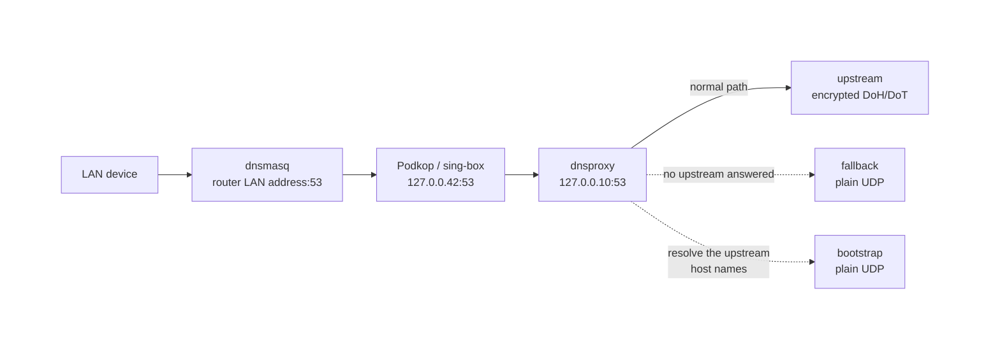

# Podkop Subscriptions

An OpenWrt add-on for [Podkop](https://github.com/itdoginfo/podkop). It downloads proxy links from HTTP/HTTPS subscriptions, drops unwanted and broken ones, validates them against Podkop/sing-box, and writes the resulting list into a chosen section of `/etc/config/podkop`. It also works with [Tachyon](https://github.com/Dushnilin/tachyon).

The guiding principle is **never break a working configuration.** If a subscription fails to load, comes back empty, or serves broken links, the current Podkop section is left as it was.

[Русская версия](README_RU.md) · [Changelog](CHANGELOG.md)

> The LuCI page, the status line and the log messages are in Russian. This README quotes them as they appear and explains them in English.

<details>
<summary><b>Features</b></summary>

- reads subscriptions as plain link lists, base64 and JSON (Clash/Mihomo objects and Xray configs);
- fetches them with the fingerprint of a real mobile client and picks the profile a panel serves the most nodes to;
- recognises the stubs and placeholder nodes panels use to signal refusal;
- understands `vless://`, `trojan://`, `ss://`, `socks4://`, `socks4a://`, `socks5://`, `hy2://`, `hysteria2://`;
- validates links with a Python checker and `sing-box check` **before** writing to Podkop, and never touches a working section when no valid links remain;
- filters links with a regular expression, collapses SNI rotations and `IP/domain:port` duplicates, and expands a node's domain into one link per IP;
- caps the number of links, drops high-latency ones and prunes links that stay dead;
- keeps a protected list of your own links;
- works over SSH and cron with no LuCI at all; the schedule applies itself after Apply in LuCI;
- catches up on a missed update after router downtime;
- guards every execution path with a shared lock.

</details>

## Install

The interactive installer asks about the LuCI panel and about creating a config:

```sh
wget -O /tmp/podkop-sub-install.sh https://raw.githubusercontent.com/makxis/podkop-subscriptions/main/install.sh && sh /tmp/podkop-sub-install.sh
```

Unattended, with the LuCI panel (recommended if unsure):

```sh
wget -O /tmp/podkop-sub-install.sh https://raw.githubusercontent.com/makxis/podkop-subscriptions/main/install.sh && sh /tmp/podkop-sub-install.sh --remote --with-panel --no-config
```

With `--no-config` an existing config is never rewritten; if none exists, a disabled example is created that you then set up in LuCI.

## First setup

1. **Prepare a section in Podkop.** Links are written into an existing section of `/etc/config/podkop`, so create it in Podkop first.
2. **Add your subscriptions.** LuCI → **Services → Подписки Podkop**: enable the group, pick the target section, add the subscription URLs and, if you want automatic updates, enable them under «Расписание обновлений» (update schedule). Press **Save & Apply**. That only stores the settings; no links are fetched yet.
3. **Fetch links for the first time** with the command in [Update links now](#update-links-now), or with the **Запустить updater** (run updater) button at the bottom of the page. The command is the better choice the first time: the whole log is right in the terminal, showing whether the sources are reachable, whether the filter cuts too much, and how many links reached Podkop.
4. **Check the result:**

   ```sh
   /usr/bin/podkop-sub-updater.py --status-summary
   ```

   A healthy status line (`Состояние: OK` means "state: OK"):

   ```text
   Состояние: OK — обновлено: 2026-05-31 23:49, источники: 3/3, ключей в секции: 75,
   рабочих: нет данных, удалено: 0, локальных: 2, автообновление: включено.
   ```

5. **Clean up installation leftovers:**

   ```sh
   /usr/bin/podkop-sub-clean-temp
   ```

   Removes downloaded archives, unpacked directories and the LuCI cache. Configs, your own links, `state.json`, backups and the last run log are kept.

<details>
<summary><b>Setup over SSH, without the panel</b></summary>

Edit the same config:

```sh
vi /etc/config/podkop_subscriptions
uci commit podkop_subscriptions && reload_config
```

`reload_config` is required: without it the settings are saved, but a new schedule never reaches cron.

Minimal working config:

```text
config subscription_group 'main'
    option enabled '1'
    option target_section 'main'
    list source 'https://example.com/subscription'
    option use_local_links '1'
    option regex ''
    option match_mode 'ifnotmatch'
    option on_empty 'skip'
    option proxy_type 'urltest'
    option max_links '50'
    option max_latency_ms '500'
    option force_cleanup '0'
    option dedupe_sni_rotation '1'
    option dedupe_endpoint_host '0'

config subscription_schedule 'main_0310'
    option enabled '1'
    option hour '3'
    option minute '10'
    option jitter '1800'
    option force '0'
```

Every option is described in the [reference](#reference), under "Configuration".

</details>

## Update links now

```sh
/usr/bin/podkop-sub-updater.py --subs /etc/config/podkop_subscriptions --config /etc/config/podkop --force
```

The full cycle: download the subscriptions, filter, validate and write the links into Podkop. The whole log goes straight to the terminal, and the command blocks until it finishes and returns an exit code. It is the main tool both for the first setup and for investigating any problem.

<details>
<summary><b>Sample output and how to read it</b></summary>

```text
[INFO] === ЗАПУСК ОБНОВЛЕНИЯ ПОДПИСОК ===
[INFO] Профиль запроса подписок: v2raytun/android, Android, Android 11, OnePlus MT2110; ...
[INFO] источник 1: попытка 1/3, лимит 45s, на соединение 15s
[INFO] [main]: источник 1 (base64) -> ссылок после фильтра: 96
[INFO] [main]: Дубликатов в новых ссылках подписки отброшено: 4
[INFO] [main]: Итого уникальных новых ссылок из внешних подписок: 92
[INFO] [main]: для совместимости с Podkop добавлен type=tcp в ключах: 4
[INFO] [main]: проверка совместимости Podkop/sing-box: принято 75, отброшено 0, sing-box check запусков: 2
[INFO] [main]: limit max_links=50, current=48, new_candidates=75, potential=80
[INFO] [main]: итог: добавлено=6, удалено=2, дубликатов в текущем конфиге=0, ключей итого=50
[INFO] Успешно завершено: конфиг обновлён, Podkop перезапущен.
```

These lines show where links get lost: fetching a source (`источник` = source), the regex filter, deduplication, the compatibility check (`принято` = accepted, `отброшено` = rejected), or the `max_links` cap.

Subscription URLs and proxy links are replaced with `<remote-url>` and `<proxy-link>` in the output, and parameters such as `sni=`, `uuid=`, `password=` become `<hidden>`. Sources are labelled `источник 1`, `источник 2` and `локальный список` (local list). The log is safe to share and to attach to an issue as is.

`/usr/bin/podkop-sub-run-now` runs the same cycle in the background and logs to `/tmp/podkop-sub-updater.log`. It exists so the **Запустить updater** button in LuCI can show a result. From a console the synchronous command above is simpler: a background run's output has to be chased with `tail -f`.

</details>

## Upgrade

```sh
wget -O /tmp/podkop-sub-upgrade.sh https://raw.githubusercontent.com/makxis/podkop-subscriptions/main/install.sh && sh /tmp/podkop-sub-upgrade.sh --remote --with-panel --no-config && /usr/bin/podkop-sub-clean-temp
```

The subscriptions config, your own links and `state.json` are left alone. The panel is upgraded the way it was installed: a hidden one stays hidden, a visible one stays visible. Only `--with-panel-visible` brings a hidden panel back into the menu.

Before upgrading, the installer saves an archive of the previous version together with the configs and state: `/root/podkop-subscriptions-upgrade-backup-<date>.tar.gz`. The three newest are kept.

## Uninstall

```sh
wget -O /tmp/podkop-sub-uninstall.sh https://raw.githubusercontent.com/makxis/podkop-subscriptions/main/uninstall.sh && sh /tmp/podkop-sub-uninstall.sh
```

Removes the scripts, the LuCI page, the procd trigger and the cron lines. Configs, accumulated state and the links already written into the Podkop sections all stay in place. To wipe the settings as well (`/etc/config/podkop_subscriptions` and the whole `/etc/podkop-subscriptions/` directory with your own links), add `--purge-config`:

```sh
sh /tmp/podkop-sub-uninstall.sh --purge-config
```

## DNS via dnsproxy (optional)

A separate script, not directly related to subscriptions. It installs AdGuard dnsproxy on `127.0.0.10:53`: DNS queries go out encrypted to several independent DoH servers at once and the first answer wins, and if all of them are unreachable, the query falls back to plain DNS. The config is lean on purpose: without HTTP/3 and its own cache, dnsproxy takes a few megabytes of RAM.

The script has its own version numbering. It prints the installed version at the end of the run, as `Версия установщика: 1.9.0`.

```sh
wget -O /tmp/install-dnsproxy.sh https://raw.githubusercontent.com/makxis/podkop-subscriptions/main/install-dnsproxy.sh && sh /tmp/install-dnsproxy.sh
```

Install and test the upstream servers in one command:

```sh
wget -O /tmp/install-dnsproxy.sh https://raw.githubusercontent.com/makxis/podkop-subscriptions/main/install-dnsproxy.sh && sh /tmp/install-dnsproxy.sh --test-servers
```

- **Re-running is safe**, and it brings a router set up by an older version of the script to the current configuration. Servers chosen earlier and the LuCI presets are kept. If the final check fails, the script puts everything back on its own.
- **Podkop is left alone** unless you pass `--configure-podkop`. To do it by hand, set Podkop's DNS type to `udp` and the server to `127.0.0.10` without a port (with a port, Podkop's diagnostics report an error).
- **Picking servers for your network** is a separate step you can run at any time. It needs a terminal: at the end the test shows two lists and asks whether to apply them.

  ```sh
  wget -O /tmp/test-doh.sh https://raw.githubusercontent.com/makxis/podkop-subscriptions/main/test-doh.sh && wget -O /tmp/servers.txt https://raw.githubusercontent.com/makxis/podkop-subscriptions/main/servers.txt && sh /tmp/test-doh.sh
  ```

<details>
<summary><b>install-dnsproxy.sh flags</b></summary>

| Flag | What it does |
|---|---|
| `--configure-podkop` | Point Podkop's DNS at dnsproxy automatically. By default `/etc/config/podkop` is not modified. |
| `--no-podkop-restart` | With `--configure-podkop`: configure Podkop but do not restart it. |
| `--no-podkop` | Leave Podkop alone. This is the default; the flag is kept for compatibility. |
| `--test-servers` | After installing, test the servers from `servers.txt` with `test-doh.sh`. |
| `--servers-list PATH` | With `--test-servers`: use this list instead of `servers.txt`. |
| `--reset-servers` | Do not keep the upstreams chosen earlier; write the default list. |
| `--no-isp-dns` | Do not add the ISP's resolvers to bootstrap and fallback. |
| `--config-only` | Do not install packages, only write the config. |
| `--no-luci` | Do not install `luci-app-dnsproxy`. |
| `--release 24.10` | Force the Fantastic Packages branch. |
| `--arch x86_64` | The Fantastic Packages architecture directory to take `luci-app-dnsproxy` from. It does not affect dnsproxy itself. |

</details>

<details>
<summary><b>What exactly the installer configures</b></summary>

- **A lean config.** HTTP/3, dnsproxy's own cache and optimistic cache (dnsmasq already caches), DNS64, EDNS Client Subnet, verbose logging, hosts processing, private reverse DNS and the local DoH/DoT server are all off. On a router with 256 MB of RAM, dnsproxy with HTTP/3 and its cache grew to about 60 MB; without them it stays at a few megabytes.
- **A 5 s upstream timeout** instead of 10 s. When the connection drops, every query waits out the upstream timeout and then the fallback one, and those pending queries pile up in memory. Clients have stopped waiting for an answer that takes longer than 5 seconds anyway.
- **Upstreams** run in `parallel` mode. A first install writes Cloudflare, ControlD, Quad9 and AdGuard. A re-run keeps the upstreams already chosen, including `[/domain/]address` rules; `--reset-servers` restores the default list.
- **Bootstrap and fallback** are rebuilt on every run: the plain resolvers from `servers.txt` are queried from the router itself, and four responding addresses from different operators are written, followed by the ISP's resolvers without a test (`--no-isp-dns` turns that off).
- **Sections the script does not own are kept**, such as the presets of newer `luci-app-dnsproxy` versions (`config profile 'preset_…'`). The assembled config is parsed by `uci` before it replaces the live one.
- **The run ends** with the running dnsproxy's command line and memory. A few megabytes of RSS is the expected figure right after a fresh start. If memory keeps growing to 50–100 MB over time, that is a leak worth investigating, not a reason to add swap.
- **`luci-app-trafficctl` is removed when SQM is enabled**: its HTB/IFB shaping on top of SQM/CAKE limited traffic a second time. Without SQM the package stays and the script only warns.
- **The web interface**, `luci-app-dnsproxy`, is installed last, once DNS is configured and verified, and only if it is not there yet. A failure there is only a warning: DNS works without the panel. For x86 the `x86_64` directory of Fantastic Packages is tried as well, since the package is built as `_all` and does not depend on the architecture.
- Works with both opkg (OpenWrt 24.10 and older) and apk (25.12 and newer). The branch and architecture come from `/etc/openwrt_release`; if detection fails, set them with `--release` and `--arch`.

</details>

<details>
<summary><b>Verification, rollback and re-runs</b></summary>

After writing the config the script waits for dnsproxy to answer on its address, and at the very end checks that ordinary name resolution on the router still works. The second check only applies when names resolved before the installation, so a WAN that is already down cannot look like damage done by the script. If verification fails, the installation is rolled back in full.

The rollback is a ready-made `rollback.sh`, written into the backup directory `/root/dnsproxy-backup-<date>` **before** anything is changed. It has the previous dnsproxy config, Podkop's previous DNS settings, and whether dnsproxy was installed and enabled baked in, so it can be run by hand later as well. To return to the state before the latest run:

```sh
sh "$(ls -d /root/dnsproxy-backup-* | tail -n 1)/rollback.sh"
```

Every run makes its own backup, so the earliest directory holds the original config.

Only one instance runs at a time, guarded by `/tmp/install-dnsproxy.lock`. Starting the script while a previous run is still going (say, after a dropped SSH session) makes it ask, in a terminal, whether to kill the earlier run or follow its output from `/tmp/install-dnsproxy.log`. Without a terminal it follows rather than kills. A lock left by a crashed run is cleared automatically. Ctrl-C ends the run, and if anything had already changed, the script prints the rollback command.

</details>

<details>
<summary><b>How test-doh.sh picks servers</b></summary>

- **Candidates** come from `servers.txt`, one server per line: `ADDRESS [OPERATOR]`. A URL (`https://`, `tls://`, `quic://`) is an Upstream DNS Server candidate, a bare IPv4 address a Bootstrap and Fallback DNS Server candidate. Without a tag the operator is the second-level domain, and for an IP the address itself.
- **Order.** Plain resolvers are tested first, DoH after them. The best plain ones plus the ISP's resolvers serve as bootstrap for the DoH test, so when an ISP blocks some public resolvers on port 53, DoH servers are still tested fairly instead of failing to resolve their own host names.
- **Scoring.** A server has to answer for three domains (`github.com`, `raw.githubusercontent.com`, `release-assets.githubusercontent.com`), each within 1000 ms (`--timeout-ms`). 3/3 means GOOD. A server that fails once is not queried further, since it can no longer reach 3/3.
- **Selection.** Up to five DoH servers by latency go to Upstream; up to four plain resolvers go to Bootstrap and Fallback, followed by the ISP's resolvers without a test. The best server of each operator is taken first, and second addresses of the same operators only after that: five Cloudflare addresses are not five independent upstreams.
- **Applying.** Only in a terminal and only after `y`. A list where nothing reached 3/3 stays as it was, and `[/domain/]address` rules in upstream are kept. Before writing, the config is copied to `/root/dnsproxy-servers-backup-<date>.config`; after the restart dnsproxy is checked with a lookup for `openwrt.org`, and a failed lookup puts everything back.
- **Load.** Servers are tested one at a time, at most one test dnsproxy (on `127.0.0.11`) runs at any moment, and waiting relies on `nslookup`'s own timeout with no polling loops. Only `dnsproxy` and `nslookup` are needed, no Python.

There are no family (adult content) filters in the list: in `parallel` mode the fastest answer wins, so such a filter would block sites at random. From Russia, Yandex is nearly always the fastest and will answer most queries; if you want foreign upstreams only, delete its lines from `servers.txt`.

</details>

<details>
<summary><b>The path of a DNS query, and why there are three server lists</b></summary>


```mermaid
%%{init: {"flowchart": {"diagramPadding": 90}}}%%
flowchart LR
    C["LAN device"] --> D["dnsmasq<br/>router LAN address:53"]
    D --> P["Podkop / sing-box<br/>127.0.0.42:53"]
    P --> X["dnsproxy<br/>127.0.0.10:53"]
    X -->|"normal path"| U["upstream<br/>encrypted DoH/DoT"]
    X -.->|"no upstream answered"| F["fallback<br/>plain UDP"]
    X -.->|"resolve the upstream<br/>host names"| B["bootstrap<br/>plain UDP"]
```

For the domains Podkop routes through the proxy, it answers with a fake IP from `198.18.0.0/15`. On the LAN those domains therefore resolve to `198.18.x.x`, which is expected.

The server lists live in the `servers` section of `/etc/config/dnsproxy`, and each answers a different question:

| List | When it is used | What belongs in it |
|---|---|---|
| `upstream` | Always, the normal path | Encrypted DoH/DoT only. This is what buys privacy |
| `bootstrap` | To turn the `upstream` host names into IPs | Plain IPs. Without it the encrypted addresses cannot be resolved at all |
| `fallback` | Only when no `upstream` answered | Plain IPs. This buys availability, not privacy |

`upstream` runs in `parallel` mode: every server is queried at once and the first answer wins. One slow server costs nothing, and an unreachable one simply never wins the race.

`fallback` exists precisely for the case where the encrypted addresses are unreachable, so demanding encryption from it defeats its purpose. The cost is that those queries leave in plain text.

`bootstrap` is easy to overlook. If it contains only addresses that might become unreachable, the upstreams fail to come up, not because they are blocked but because nothing can resolve their host names. That is why the installer does not hard-code either list and tests the candidates from the router itself.

Order in `bootstrap` and `fallback` is not a priority: dnsproxy queries every address at once and takes the first answer. Hence the short lists: while the upstreams are unreachable, each query holds a goroutine in dnsproxy for every fallback address.

</details>

<details>
<summary><b>Checking a server by hand</b></summary>

Run a throwaway instance alongside the live one:

```sh
dnsproxy --listen 127.0.0.1 --port 15353 \
         --upstream https://dns.quad9.net/dns-query \
         --bootstrap 8.8.4.4 --timeout 5s &
nslookup -port=15353 openwrt.org 127.0.0.1
```

Look at the share of answered queries, not just the average time: a resolver that answers a third of the time is worse than a slow but steady one. Port `15353` is arbitrary; the live dnsproxy on `127.0.0.10:53` is left untouched.

Edits go through `uci` and take effect on restart:

```sh
uci -q del dnsproxy.servers.upstream
uci add_list dnsproxy.servers.upstream='https://dns.cloudflare.com/dns-query'
uci add_list dnsproxy.servers.upstream='https://dns.quad9.net/dns-query'
uci commit dnsproxy
/etc/init.d/dnsproxy restart
```

</details>

## Troubleshooting

**No links appeared in Podkop.** Run the update synchronously and read the output:

```sh
/usr/bin/podkop-sub-updater.py --subs /etc/config/podkop_subscriptions --config /etc/config/podkop --force
```

**The log says `отброшено 0` (rejected 0) but there are few links.** The validator is not to blame; look at `regex`, `dedupe_*`, `max_links`, `max_latency_ms` or `force_cleanup`.

**Scheduled updates do not run.** The status shows `автообновление: не применено` (auto-update: not applied), meaning cron is out of sync:

```sh
/usr/bin/podkop-sub-cron-sync
grep -E 'podkop-sub-health|podkop-sub-updater|podkop-sub-catchup' /etc/crontabs/root
```

**The updater hangs or is permanently "running".** Check the state and the locks:

```sh
/usr/bin/podkop-sub-run-now --status
ls -la /tmp/podkop-sub-updater.lock /tmp/podkop-sub-updater.flock
```

Exit code `75` means the lock stayed busy for more than 300 seconds. If a background run died without releasing its lock (say, killed by the OOM killer), the lock is cleared on the next call to `podkop-sub-run-now`, including the button in LuCI.

**The LuCI page does not open after installation.** Clear the caches:

```sh
/usr/bin/podkop-sub-clean-temp
/etc/init.d/rpcd restart
/etc/init.d/uhttpd restart
```

**After an upgrade the panel says «Ошибка сохранения: Доступ запрещён» (save error: access denied) or behaves oddly.** Most likely the browser is running old JavaScript from its cache. Reload the page with Ctrl+Shift+R and log in to LuCI again: the installer restarts rpcd, which drops the old session.

**dnsproxy uses a lot of memory.** Run the dnsproxy installer again: it moves the router to the lean configuration and shows the process's memory at the end.

**DNS stopped working after installing dnsproxy.** Return to the state before the latest run:

```sh
sh "$(ls -d /root/dnsproxy-backup-* | tail -n 1)/rollback.sh"
```

## Reference

Details you do not need for installing and everyday use.

<details>
<summary><b>All commands</b></summary>

**Everyday**

| Command | What it does |
|---|---|
| `/usr/bin/podkop-sub-updater.py --subs /etc/config/podkop_subscriptions --config /etc/config/podkop --force` | **Update links now.** The full cycle (download → filter → validate → write to Podkop), synchronously, with the whole log on the terminal and an exit code at the end. |
| `/usr/bin/podkop-sub-run-now` | The same cycle in the background, logging to `/tmp/podkop-sub-updater.log`. Needed by the LuCI button. Silently skips if the updater is already running. |
| `/usr/bin/podkop-sub-run-now --status` | Background-run state: `running`, `finished` or `idle`, plus the tail of the log. |
| `/usr/bin/podkop-sub-run-now --version` | Installed version. |
| `/usr/bin/podkop-sub-updater.py --status-summary` | One-line status: update time, sources, link count, auto-update state. |
| `/usr/bin/podkop-sub-updater.py --fail-count` | Accumulated `fail_count` per link. The links themselves are not printed, so the output is safe to share. |

**Install and upgrade**

| Command | What it does |
|---|---|
| `sh install.sh` | Interactive install: asks about the LuCI panel and the config. |
| `sh install.sh --with-panel` | Install the LuCI panel. A panel already installed hidden stays hidden. |
| `sh install.sh --with-panel-visible` | Install the panel and put it in the menu even if it was hidden before. |
| `sh install.sh --with-panel-hidden` | Install the panel files without a menu entry. |
| `sh install.sh --no-panel` (`--core-only`) | Core only, no LuCI. Managed over SSH and cron. |
| `sh install.sh --configure` | Create or recreate `/etc/config/podkop_subscriptions` without prompting. |
| `sh install.sh --no-config` | Leave an existing config alone. Required when upgrading in place. |
| `sh install.sh --remote` | Pull files from GitHub (for a standalone `install.sh` in `/tmp`). |
| `sh install.sh --local` | Use files next to the script (for a repository clone). |
| `sh install.sh --repo=owner/repo` | Install from a fork. |
| `sh install.sh --branch=main` | Install from another branch. |
| `sh install.sh --raw-base=URL` | Custom base URL instead of raw.githubusercontent.com. |
| `sh podkop-sub-upgrade` | Upgrade from a local repository clone, shorthand for `sh install.sh --local --with-panel --no-config`. The script lives in the repository and is **not** copied to `/usr/bin`. |
| `/usr/bin/podkop-sub-clean-temp` | Delete installation leftovers and the LuCI cache. Settings, links, state, backups and the log are untouched. |

**Diagnostics and maintenance**

| Command | What it does |
|---|---|
| `/usr/bin/podkop-sub-updater.py --version` | Updater version. |
| `/usr/bin/podkop-sub-updater.py --observe-only --config /etc/config/podkop` | Observation only: refreshes `fail_count` from Podkop URLTest data without touching the config. Runs hourly from cron. |
| `/usr/bin/podkop-sub-updater.py --catch-up ...` | Update subscriptions if the last successful update is older than 24 hours. Started by `/etc/init.d/podkop_subscriptions` 5 minutes after boot. |
| `/usr/bin/podkop-sub-updater.py --catch-up-retry ...` | Retry catch-up only if the previous one failed. Runs from cron every 30 minutes. |
| `/usr/bin/podkop-sub-cron-sync` | Rebuild the managed lines in `/etc/crontabs/root` from the current config and print the result. Normally invoked automatically; run it by hand for diagnostics. |

**Updater flags**

| Flag | Default | Meaning |
|---|---|---|
| `--config PATH` | `/etc/config/podkop` | Path to the Podkop config. |
| `--subs PATH` | `/etc/config/podkop_subscriptions` | Path to the subscriptions config. |
| `--state PATH` | `/etc/podkop-subscriptions/state.json` | Path to the state file. |
| `--force` | off | Rewrite the Podkop section and restart the service even when nothing changed. |
| `--delete-after-fails N` | `72` | Delete a link after N consecutive failed observations (roughly three days with the hourly observer). |
| `--min-keep N` | `1` | Minimum number of links that must never be pruned from a section. |

</details>

<details>
<summary><b>Configuration: every option</b></summary>

Everything lives in `/etc/config/podkop_subscriptions`, editable through LuCI or directly. A minimal working config is shown above, under "Setup over SSH, without the panel".

**`config subscription_group`**

| Option | Default | Purpose |
|---|---|---|
| `enabled` | `1` | `0`: the group is ignored entirely. |
| `target_section` | section name | Which `/etc/config/podkop` section to write links into. Several groups may target one section; their results are merged. |
| `source` (list) | | Subscription URL. Several lines mean redundancy, not duplication. |
| `use_local_links` | `0` | `1`: also include your own links from `/etc/podkop-subscriptions/local-links`. |
| `regex` | empty | Filter applied to the proxy link. Empty disables filtering. |
| `match_mode` | `ifnotmatch` | `ifmatch` keeps matching links only, `ifnotmatch` excludes them. |
| `on_empty` | `skip` | When the filter leaves nothing from a source: `skip` skips that source, `all` takes every link unfiltered. |
| `proxy_type` | `urltest` | Podkop section type: `urltest` or `selector`. |
| `max_links` | `0` | Maximum links in a section. `0` or empty means unlimited. |
| `max_latency_ms` | `0` | Drop links slower than this, based on Podkop URLTest data. `0` or empty: never drop by latency. |
| `force_cleanup` | `0` | `1`: prune links with `fail_count >= 2` and over-latency links even when `max_links` is not reached. |
| `dedupe_sni_rotation` | `0` | `1`: treat links differing only by `sni` as one. |
| `dedupe_endpoint_host` | `0` | `1`: collapse links sharing the same `IP/domain:port`. |
| `expand_domain_ips` | `1` | A domain resolving to several addresses also yields one link per IP; the domain link stays. `0` turns it off. |
| `fingerprint` | empty | Fingerprint profile for this group. Empty means `default`. |
| `fingerprint_probe_days` | `7` | How often to re-measure which profile yields more nodes. `0`: measure once and never again. |

When several groups write into one section, numeric limits take the smallest value set, and the flags (`force_cleanup`, both `dedupe_*`) turn on if enabled in at least one group.

**`config subscription_schedule`**

| Option | Purpose |
|---|---|
| `enabled` | `0`: the schedule is not installed into cron. |
| `hour` | Hour of the run (0–23). |
| `minute` | Minute of the run (0–59). |
| `jitter` | Random pre-run delay in seconds. `1800` means up to 30 minutes, `0` means none. Keeps you from hitting the subscription server at the same second as everyone else. |
| `force` | `1`: append `--force`, that is, rewrite the section and restart Podkop even without changes. |

You can define several schedules, for example a night and a daytime one.

</details>

<details>
<summary><b>How links are processed</b></summary>

```text
download subscriptions
→ extract proxy links (plain text or base64)
→ apply regex
→ remove duplicates
→ normalize missing type=tcp for vless/trojan
→ Python format checks
→ sing-box check on a temporary config
→ SNI / endpoint deduplication
→ apply limits, latency and fail_count
→ write to Podkop
```

This is **not** a ping or speed test. It protects against malformed links that would break sing-box config generation. If no compatible links remain, the current Podkop section is left unchanged.

The log line:

```text
[main]: проверка совместимости Podkop/sing-box: принято 75, отброшено 0, sing-box check запусков: 2
```

`отброшено 0` (rejected 0) means the validator and `sing-box check` dropped nothing, so any missing links were lost to the regex, deduplication, limits or forced cleanup. Which link failed, and on which value, is logged at DEBUG level:

```text
[x2x]: ключ не для Podkop (🇳🇱 Нидерланды): transport не поддерживается Podkop: xhttp
```

**Why there are two checks.** They answer different questions, and the first one is not a weaker version of the second.

The link is turned into an outbound by **Podkop itself**, in `/usr/lib/podkop/sing_box_config_facade.sh`. That converter, not sing-box, sets the ceiling: whatever sing-box can do is useless if Podkop cannot build it. So the first check mirrors exactly its `case` branches, on the scheme, on `security` and on `type`. What happens without it, verified on a router:

| Link | Podkop | `sing-box check` |
|---|---|---|
| `type=xhttp`, `type=httpupgrade` | logs `Unknown transport 'xhttp' detected.` and builds the outbound **with no transport at all**, i.e. plain TCP | passes |
| `vmess://`, `tuic://` | `Unsupported proxy vmess type. Aborted.` and exits with an error | nothing to check |

In the first case the link quietly becomes a dead node sitting in URLTest while the config itself is valid and passes the second check. In the second, a single such link leaves the router with no proxy at all. Both are only catchable before conversion.

The second check catches what conversion hides: an unknown shadowsocks method, reality without uTLS, and anything else that only surfaces when the finished config is parsed. The first check is also what builds the config for the second one: `sing-box check` reads JSON, not links.

</details>

<details>
<summary><b>Regex filter</b></summary>

The filter is applied to the **entire** proxy link after percent-decoding. Matching is case-insensitive: `YouTube`, `youtube` and `YOUTUBE` are the same.

```text
match_mode = ifmatch     # keep matching links only
match_mode = ifnotmatch  # exclude matching links
```

An excluding filter almost always needs the pair `match_mode = ifnotmatch` and `on_empty = skip`.

Example: exclude `xhttp` anywhere in the link, but match the other words only in the node name (after `#`):

```text
xhttp|#.*(YouTube|youtube|Ютуб|ютуб|YT|без рекламы|Messengers|MultiIP|Белый|список|Россия|Финляндия|🇦🇺|🇫🇮|\bAI\b)
```

```text
xhttp      matches anywhere in the proxy link;
#.*(...)   everything in the brackets is matched only after the hash, i.e. in the node name;
\bAI\b     AI only as a standalone word, so Premium+Main is not hit;
YouTube    must be listed separately: YT does not match YouTube.
```

Escape dots in IP addresses: `107\.150\.93\.`

Verify after changing a filter:

```sh
/usr/bin/podkop-sub-updater.py --subs /etc/config/podkop_subscriptions --config /etc/config/podkop --force
grep -nE "Premium|LTE|YouTube|Финляндия|YT" /etc/config/podkop
```

An invalid regular expression does not abort the update: the source is skipped with an `ERROR` in the log.

</details>

<details>
<summary><b>Your own links (local-links)</b></summary>

```sh
vi /etc/podkop-subscriptions/local-links
```

One link per line:

```text
vless://...
trojan://...
ss://...
```

Attach them to a group with `option use_local_links '1'`.

Your own links are never pruned automatically and never replaced by SNI or IP deduplication. They do **not** count as a network source in the statistics: they neither increase the successful-subscription counter nor mask problems with external URLs.

Before 3.6.3 this file lived at `/etc/config/podkop-local-links`, which broke uci: everything under `/etc/config` is parsed as uci, and a plain list of links is not. The installer moves the file automatically, and the updater still reads the old path if the new one does not exist yet.

</details>

<details>
<summary><b>Deduplication, limits and fail_count</b></summary>

**SNI rotations, `dedupe_sni_rotation`.** If a new link differs from an old one only by `sni`, the old variant is replaced by the new one.

**`IP/domain:port`, `dedupe_endpoint_host`.** The server address is compared **together with the port**. The same host on different ports counts as different working variants, and they do not evict each other:

```text
server.example.com:443     ← different links,
server.example.com:8443    ← both are kept
```

Only fully matching `host:port` pairs are collapsed. `transport`, `sni`, `path`, `fp` and the node name play no part in the comparison; the last variant from the subscription wins. The option is off by default: enable it only if you are sure that several links on one host really are a rotation rather than distinct working variants.

**Limits:**

| Option | Effect |
|---|---|
| `max_links '50'` | Maximum links in a section. `0` or empty means unlimited. |
| `max_latency_ms '500'` | Drop links slower than this, based on Podkop URLTest data. `0` or empty: never drop by latency. |
| `force_cleanup '0'` | `1`: prune links with `fail_count >= 2` and over-latency links even when `max_links` is not reached. |

`fail_count` is accumulated by the hourly observer (`--observe-only`) from Podkop URLTest data. To inspect it without printing the links themselves:

```sh
/usr/bin/podkop-sub-updater.py --fail-count
```

</details>

<details>
<summary><b>Expanding domains into IPs</b></summary>

A subscription often points at a node by domain while several servers sit behind it. Which one you get is up to DNS, and that is not necessarily the fastest.

The `expand_domain_ips` option (**Разворачивать домены в IP** in LuCI) adds one link per IP for any domain resolving to two or more addresses. The domain link stays, so the entry keeps working when the addresses change. Podkop's URLTest then measures the servers individually and picks the best.

Only the host is substituted. `sni`, `host` and the remaining parameters keep pointing at the domain, otherwise TLS and the ws transport break. The name gains the address's last octet as a suffix, or the whole address when the octets collide. Domains with a single address are left alone. Expansion runs after the regex filter, so links that get dropped never cost a DNS lookup.

The number of links grows noticeably, so the `max_links` cap fills up sooner.

DNS gets at most 30 seconds per source: if the resolver is slow, the remaining domains are left unexpanded and the log says so.

The option is on by default, including for configs that do not carry it at all. Turn it off with an explicit `option expand_domain_ips '0'` in the group, or by clearing the checkbox in LuCI; that choice survives later upgrades.

</details>

<details>
<summary><b>Client fingerprint: the headers subscriptions are fetched with</b></summary>

Subscription panels (Remnawave, Marzban, 3x-ui and the like) serve different content to different clients and tell them apart by request headers: `User-Agent`, `X-HWID`, `X-Device-Model`, `X-App-Version`. An ordinary HTTP client gets a truncated list, a stub page, or a refusal.

So the updater fetches subscriptions with a header set captured from a real mobile client. It never sends the router's real model or kernel version. The set lives in the config and is editable in LuCI:

```text
config fingerprint 'default'
    option enabled '1'
    list header 'User-agent: v2raytun/android'
    list header 'X-HWID: {hwid}'
    list header 'X-Device-OS: Android'
    list header 'X-Ver-OS: Android 11'
    list header 'X-Device-Model: OnePlus MT2110'
    list header 'X-App-Version: 5.25.81'
```

Line order and header-name case are preserved exactly, since panels look at both. `Host` and `Accept-Encoding` can be left in; the updater drops them itself. The `default` profile applies to every subscription group, and a group can pick a different one with the `fingerprint` option.

**X-HWID.** A value of `{hwid}` means "generate a personal identifier on the first update and write it here": 16 hex characters from `/dev/urandom`. It never changes afterwards, because to a panel a changed `X-HWID` looks like a new device. If the config has no `fingerprint` section at all, one is created on the first run with the built-in set and an HWID of its own.

**Device limits.** Many panels cap the number of devices per subscription and bind them by `X-HWID`. Every router with its own identifier takes a slot. If that gets in the way, copy the generated value from the first router to the others so they appear as a single device.

**Several profiles.** One panel expects v2raytun, another Happ, and no manual mapping is needed. On the first read of a source the updater queries every profile and remembers the one that yielded the most nodes: the difference can be real, with one client getting 27 nodes and another 30 from the same subscription. A regular run costs a single request with the remembered profile. It re-measures when there is no choice yet, when the profile has vanished from the config, when `fingerprint_probe_days` has passed, or when the remembered profile suddenly yields noticeably fewer nodes.

**Refusals are remembered.** If a panel refused a particular profile, that profile is left out of future measurements for the source: on a panel with a device limit, the very attempt with a foreign client takes a slot. Failure is not only a download error. A panel that will not serve this client usually answers 200, either with an anti-bot stub page or with a fake node on `0.0.0.0:1` whose name carries the reason, such as «Вы достигли максимального числа устройств для вашей подписки» (you have reached the device limit for your subscription). Both are recognised, the reason is logged, and the placeholder links never reach Podkop.

**What sends the request.** When `curl` is available it is used: it sends headers byte for byte and in the given order. This adds no dependency, since Podkop itself requires `curl`. OpenWrt's stock `wget` (which is `uclient-fetch`) stays as a fallback, but it rewrites `User-Agent` with its own capitalisation and puts it last, so the fingerprint is only approximate; the log warns when that path is taken. Compression is never requested: OpenWrt builds libcurl without zlib.

</details>

<details>
<summary><b>Subscription formats and the source number in link names</b></summary>

Formats are detected automatically, in this order: base64, direct links, JSON.

| Format | Typical source |
|---|---|
| direct links, one per line | most panels |
| base64 of such a list | the same, usual packaging |
| JSON with Clash/Mihomo objects | panels and converters serving a node list as JSON |
| JSON with full Xray configs | an array of configs, one per node, name in `remarks` |

Parsing JSON needs no `python3-yaml`: Clash objects arrive as plain JSON. The link-building rules are ported from a mature open implementation and checked against its output on the same data. If a source can hand out ready-made links, prefer those: fewer conversions, fewer ways to drift.

**Source number.** Every link from a subscription gets the source's number prefixed to its name, in the order the sources are listed in the group: `[2] 🇳🇱 Нидерланды`. The Podkop list then shows where a node came from, and the number matches the `источник 2` lines in the log. The number is refreshed on every run, so reordering the sources renumbers the links, including those already in the section. The name plays no part in identifying a link (`stable_id` is computed from the link without the part after `#`), so renaming creates no new links and resets no failure counts. Your own links from `local-links` get no number.

</details>

<details>
<summary><b>Auto-update, cron and catch-up</b></summary>

The schedule in `/etc/config/podkop_subscriptions` is a **saved setting**; only what reaches `/etc/crontabs/root` actually runs. That is why the status carries a separate marker:

```text
автообновление: включено      schedule defined and applied in cron
автообновление: не применено  schedule exists, but cron is not synced yet
автообновление: не задано     no schedules in the config
```

Cron is synchronized through two paths: LuCI runs `/usr/bin/podkop-sub-cron-sync` right after Save or Save & Apply, and the procd trigger `/etc/init.d/podkop_subscriptions` does the same on the system `config.change` event.

**When editing over SSH**, the `config.change` event is emitted by `reload_config` (which the Apply button in LuCI also calls), not by `uci commit`. A bare `uci commit podkop_subscriptions` does not fire the trigger, and cron keeps the old schedule. So after editing by hand, run `uci commit podkop_subscriptions && reload_config`, or call `/usr/bin/podkop-sub-cron-sync` directly. It is idempotent and uses an atomic `fcntl.flock`, so repeated and concurrent calls are safe.

Besides the `subscription_schedule` entries, two service lines are created:

```text
0 * * * *    --observe-only     # hourly fail_count collection
*/30 * * * * --catch-up-retry   # retry if catch-up failed
```

Check that they are in place:

```sh
grep -E 'podkop-sub-health|podkop-sub-updater|podkop-sub-catchup' /etc/crontabs/root
```

**Catch-up after downtime.** Cron does not run jobs missed while the router was off. So 5 minutes after boot the age of the last successful update is checked; if more than 24 hours have passed, the subscriptions are updated, and if that fails, it retries every 30 minutes until it succeeds. The post-boot run lives in `/etc/init.d/podkop_subscriptions` rather than cron, because BusyBox crond has no `@reboot`. The init script starts a procd instance named `catchup` that waits 5 minutes and runs the updater once with `--catch-up`. To inspect it:

```sh
ubus call service list | grep -A 6 podkop_subscriptions
```

The delay is the `BOOT_CATCHUP_DELAY` variable at the top of the init script.

</details>

<details>
<summary><b>Status, errors and concurrent runs</b></summary>

The status only goes into detail on a real failure: empty subscriptions, unsupported format, all links rejected, config write failure.

**What counts as a failure.** A single failing source does not: multiple subscriptions usually exist precisely for redundancy. That case is logged as `WARN`, so LuCI does not flood the interface with pop-up errors. A red error appears only when no valid links could be assembled for **any** section, and even then the previous working Podkop config is not overwritten.

**Concurrent runs.** Every updater execution path (scheduled update, `--observe-only`, catch-up, retry and manual run) shares the `/tmp/podkop-sub-updater.flock` lock:

- `--observe-only` quietly skips when the updater is busy;
- normal and catch-up runs wait up to 300 seconds for the lock;
- if the lock is still held, the run exits with a clear warning and code `75`.

The `/tmp/podkop-sub-updater.lock` directory in `podkop-sub-run-now` only reports manual-run state to LuCI; the actual protection is the flock inside the Python updater.

</details>

<details>
<summary><b>Files on the router</b></summary>

| Path | Purpose |
|---|---|
| `/etc/config/podkop_subscriptions` | Main config: subscription groups, sources, filters, limits, schedule. |
| `/etc/config/podkop` | Native Podkop config. The updater reads sections from it and writes the final links back. |
| `/etc/podkop-subscriptions/local-links` | Your own links, one per line. Protected from automatic pruning. |
| `/etc/podkop-subscriptions/state.json` | Service state: `fail_count`, last status, catch-up and retry, recently removed links. Only keeps links that are in the config now. |
| `/etc/podkop-subscriptions/podkop.bak` | Copy of the Podkop config before the updater's last write (`tachyon.bak` for Tachyon). |
| `/tmp/podkop-sub-updater.log` | Log of the last manual run (`podkop-sub-run-now` or the LuCI button). |
| `/tmp/podkop-sub-updater.status` | Machine-readable manual-run status for LuCI. |
| `/tmp/podkop-sub-updater.flock` | Shared lock across all updater execution paths. |
| `/etc/init.d/podkop_subscriptions` | procd: syncs cron on `config.change` and runs the post-boot catch-up. |
| `/usr/share/podkop-subscriptions/VERSION` | Installed version. |
| `/root/podkop-subscriptions-upgrade-backup-<date>.tar.gz` | Archive taken before a program upgrade: previous files, configs, state. The three newest are kept. |

</details>

<details>
<summary><b>Tachyon</b></summary>

Since 3.8.0 it also works with [Tachyon](https://github.com/Dushnilin/tachyon), a Podkop Plus fork that replaces Podkop. The support is partial, because Tachyon's config schema differs:

- When `/etc/config/podkop` is missing and `/etc/config/tachyon` exists, the updater switches to Tachyon on its own. Cron entries, the panel and the commands in this README stay the same.
- Links go into the section's `selector_proxy_links` and the section gets `action 'connection'`. Podkop options (`connection_type`, `proxy_config_type`, `urltest_proxy_links`) are not written: Tachyon converts them only when its package is upgraded, and until then the section would have no links.
- URLTest is a separate `config urltest` section pointing at the target. For `proxy_type 'urltest'` the updater adds a `Fastest` group if there is none; `proxy_type 'selector'` does not delete an existing group, since its settings belong to Tachyon.
- The link filter follows Tachyon: `http`, `h2` and `httpupgrade` pass, and `xhttp` passes only when the installed sing-box supports it (extended or lx). On a plain build such links are dropped with a reason saying so.
- Health comes from `tachyon clash_api get_proxies`; after an update `/etc/init.d/tachyon` is restarted.
- Do not use Tachyon's own `subscription_urls` in the same section: its outbounds shift the `<section>-N-out` numbering and the health check would mix up links.

</details>

## Compatibility

```text
OpenWrt:         24.10.3–24.10.6; 25.12.4
Podkop:          v0.7.17–v0.7.19; v0.7.22
LuCI App Podkop: v0.7.17–v0.7.19; v0.7.22
sing-box:        1.12.17; 1.12.22
```

Tachyon: tested on 1.4.3 (OpenWrt 24.10.7, sing-box 1.12.22). The updater switches to it on its own; the details are in the reference.

## License

See [LICENSE](LICENSE).
