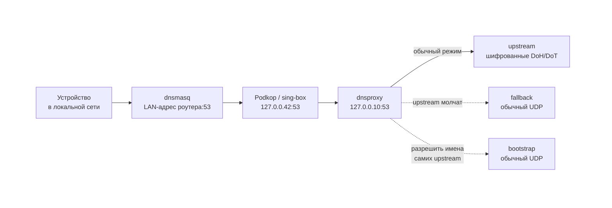

# Podkop Subscriptions

Дополнение к [Podkop](https://github.com/itdoginfo/podkop) для OpenWrt. Берёт ключи из HTTP/HTTPS-подписок, фильтрует их, проверяет на совместимость с Podkop/sing-box и записывает готовый список в выбранную секцию `/etc/config/podkop`.

Главный принцип — **не сломать рабочую конфигурацию**. Если подписка не загрузилась, вернула пустой ответ или отдала битые ключи, текущая секция Podkop остаётся нетронутой.

[English version](README.md) · [Изменения по версиям](CHANGELOG.md)

---

## Обновить ключи прямо сейчас

Основная команда, ради которой всё и нужно. Скачивает подписки, фильтрует, проверяет и записывает ключи в Podkop — **весь лог идёт прямо в терминал**, сразу видно, что происходит на каждом шаге:

```sh
/usr/bin/podkop-sub-updater.py --subs /etc/config/podkop_subscriptions --config /etc/config/podkop --force
```

Команда синхронная: ждёт завершения и возвращает код выхода. Именно её удобно запускать при первой настройке и при разборе любых проблем.

Примерно так выглядит вывод:

```text
[INFO] === ЗАПУСК ОБНОВЛЕНИЯ ПОДПИСОК ===
[INFO] Профиль запроса подписок: v2raytun/android, Android, Android 11, OnePlus MT2110; ...
[INFO] источник 1: попытка 1/3, timeout=45s
[INFO] источник 1: успешно загружен с попытки 1/3
[INFO] [main]: источник 1 (base64) -> ссылок после фильтра: 96
[INFO] [main]: Дубликатов в новых ссылках подписки отброшено: 4
[INFO] [main]: Итого уникальных новых ссылок из внешних подписок: 92
[INFO] [main]: для совместимости с Podkop добавлен type=tcp в ключах: 4
[INFO] [main]: проверка совместимости Podkop/sing-box: принято 75, отброшено 0, sing-box check запусков: 2
[INFO] [main]: limit max_links=50, current=48, new_candidates=75, potential=80
[INFO] [main]: итог: добавлено=6, удалено=2, дубликатов в текущем конфиге=0, ключей итого=50
[INFO] Успешно завершено: конфиг обновлён, Podkop перезапущен.
```

По этим строкам сразу видно, где именно теряются ключи: на загрузке источника, на regex-фильтре, на дедупликации, на проверке совместимости или на лимите `max_links`.

Ссылки на подписки и сами proxy-ключи в выводе автоматически заменяются на `<remote-url>` и `<proxy-link>`, параметры вроде `sni=`, `uuid=`, `password=` — на `<hidden>`. Источники обозначаются как `источник 1`, `источник 2` и `локальный список`. Лог можно показывать и прикладывать к issue как есть.

### Если нужен фоновый запуск

`/usr/bin/podkop-sub-run-now` делает тот же цикл, но в фоне и с записью в `/tmp/podkop-sub-updater.log` — это нужно кнопке **Запустить updater** в LuCI, чтобы веб-панель могла показать результат. Для работы из консоли смысла в нём мало: вывод придётся догонять через `tail -f`. Подробности — в разделе [Все команды](#все-команды).

---

## Быстрый старт

Шаги идут в том порядке, в котором их реально выполняют на новом роутере.

### Шаг 1. Установить

Интерактивный установщик — спросит про веб-панель LuCI и про создание конфига:

```sh
wget -O /tmp/podkop-sub-install.sh https://raw.githubusercontent.com/makxis/podkop-subscriptions/main/install.sh && sh /tmp/podkop-sub-install.sh
```

Без вопросов, с веб-панелью (рекомендуется, если не уверены):

```sh
wget -O /tmp/podkop-sub-install.sh https://raw.githubusercontent.com/makxis/podkop-subscriptions/main/install.sh && sh /tmp/podkop-sub-install.sh --remote --with-panel --no-config
```

С флагом `--no-config` конфиг не пересоздаётся: если его нет, создаётся отключённый пример, который потом настраивается в LuCI.

### Шаг 2. Настроить подписки

**Через LuCI** (если ставили с панелью):

```text
Services → Подписки Podkop
```

Укажите целевую секцию Podkop и URL подписок, нажмите **Save & Apply**.

Save & Apply только сохраняет настройки — ключи ещё не подтягиваются.

**Через SSH** — правкой конфига:

```sh
vi /etc/config/podkop_subscriptions
uci commit podkop_subscriptions && reload_config
```

`reload_config` здесь обязателен: без него расписание сохранится, но в cron не попадёт.

Минимальный рабочий пример есть в разделе [Конфигурация](#конфигурация).

### Шаг 3. Подтянуть ключи в первый раз

```sh
/usr/bin/podkop-sub-updater.py --subs /etc/config/podkop_subscriptions --config /etc/config/podkop --force
```

Именно в первый раз важно видеть весь вывод: сразу станет понятно, доступны ли источники, не режет ли лишнего regex-фильтр и сколько ключей дошло до Podkop.

В LuCI то же самое делает кнопка **Запустить updater** внизу страницы, но её вывод уходит в файл лога. До первого запуска страница показывает:

```text
Состояние: первичная настройка — нажмите кнопку «Запустить updater» внизу страницы для первого подтягивания конфигов.
```

### Шаг 4. Проверить результат

```sh
/usr/bin/podkop-sub-updater.py --status-summary
```

Нормальная строка состояния выглядит так:

```text
Состояние: OK — обновлено: 2026-05-31 23:49, источники: 3/3, ключей в секции: 75,
рабочих: нет данных, удалено: 0, локальных: 2, автообновление: включено.
```

Убедиться, что ключи действительно записаны:

```sh
grep -c "proxy_string" /etc/config/podkop
```

### Шаг 5. Убрать временные файлы установки

```sh
/usr/bin/podkop-sub-clean-temp
```

Удаляет скачанные архивы, распакованные каталоги и кэш LuCI. Конфиги, локальные ключи, `state.json`, бэкапы и лог последнего запуска сохраняются.

### Шаг 6 (позже). Обновить саму программу

```sh
wget -O /tmp/podkop-sub-upgrade.sh https://raw.githubusercontent.com/makxis/podkop-subscriptions/main/install.sh && sh /tmp/podkop-sub-upgrade.sh --remote --with-panel --no-config && /usr/bin/podkop-sub-clean-temp
```

`/etc/config/podkop_subscriptions`, локальные ключи и `state.json` при этом не пересоздаются.

---

## Проверено на

```text
OpenWrt:         24.10.3–24.10.6; 25.12.4
Podkop:          v0.7.17–v0.7.19
LuCI App Podkop: v0.7.17–v0.7.19
sing-box:        1.12.17; 1.12.22
```

## Что умеет

- загружает plain-text и base64-подписки;
- поддерживает `vless://`, `trojan://`, `ss://`, `socks4://`, `socks4a://`, `socks5://`, `hy2://`, `hysteria2://`;
- проверяет ключи Python-валидатором и `sing-box check` **до** записи в Podkop;
- не перезаписывает рабочую секцию, если валидных ключей не осталось;
- фильтрует ключи regex-выражением;
- схлопывает SNI-ротации и `IP/домен:порт`-дубликаты;
- считает `fail_count` для ключей, которые долго не работают, и умеет их вычищать;
- ограничивает количество ключей и отсекает ключи с высоким ping;
- поддерживает защищённый локальный список ключей;
- работает через SSH/cron даже без LuCI;
- пересобирает cron автоматически после Apply в LuCI (и по `reload_config`);
- догоняет пропущенное обновление после долгого простоя роутера;
- защищает все пути запуска общим файловым lock.

---

## Все команды

### Ежедневные

| Команда | Что делает |
|---|---|
| `/usr/bin/podkop-sub-updater.py --subs /etc/config/podkop_subscriptions --config /etc/config/podkop --force` | **Обновить ключи сейчас.** Полный цикл (загрузка → фильтр → валидация → запись в Podkop) синхронно, весь лог в терминал, на выходе — код возврата. Основной способ и для первой настройки, и для разбора проблем. |
| `/usr/bin/podkop-sub-run-now` | То же самое, но в фоне и с записью в `/tmp/podkop-sub-updater.log`. Нужно кнопке в LuCI; из консоли удобно, только если запуск не хочется ждать. Если updater уже работает, запуск тихо пропускается. |
| `/usr/bin/podkop-sub-run-now --status` | Состояние фонового запуска: `running` / `finished` / `idle` плюс хвост лога. |
| `/usr/bin/podkop-sub-run-now --version` | Установленная версия. |
| `/usr/bin/podkop-sub-updater.py --status-summary` | Однострочный статус для LuCI: время обновления, источники, число ключей, состояние автообновления. |
| `/usr/bin/podkop-sub-updater.py --fail-count` | Накопленные `fail_count` по ключам. Сами proxy-ссылки не печатаются — вывод можно показывать кому угодно. |

### Установка и обновление

| Команда | Что делает |
|---|---|
| `sh install.sh` | Интерактивная установка: спрашивает про панель LuCI и про конфиг. |
| `sh install.sh --with-panel` | Поставить с видимой страницей LuCI. |
| `sh install.sh --with-panel-hidden` | Поставить файлы панели, но не добавлять пункт в меню. |
| `sh install.sh --no-panel` (`--core-only`) | Только ядро, без LuCI. Управление через SSH/cron. |
| `sh install.sh --configure` | Создать/пересоздать `/etc/config/podkop_subscriptions` без вопросов. |
| `sh install.sh --no-config` | Не трогать существующий конфиг. Обязательно при обновлении поверх. |
| `sh install.sh --remote` | Брать файлы с GitHub (для запуска одиночного `install.sh` из `/tmp`). |
| `sh install.sh --local` | Брать файлы из каталога рядом со скриптом (для клона репозитория). |
| `sh install.sh --repo=owner/repo` | Установить из форка. |
| `sh install.sh --branch=main` | Установить из другой ветки. |
| `sh install.sh --raw-base=URL` | Свой базовый URL вместо raw.githubusercontent.com. |
| `sh podkop-sub-upgrade` | Обновление из локального клона репозитория. Короткая запись `sh install.sh --local --with-panel --no-config`. Этот скрипт живёт в репозитории и **не** копируется в `/usr/bin`. |
| `/usr/bin/podkop-sub-clean-temp` | Удалить временные файлы установки и кэш LuCI. Настройки, ключи, state, бэкапы и лог не трогает. |

### Диагностика и обслуживание

| Команда | Что делает |
|---|---|
| `/usr/bin/podkop-sub-updater.py --version` | Версия updater. |
| `/usr/bin/podkop-sub-updater.py --observe-only --config /etc/config/podkop` | Только наблюдение: обновляет `fail_count` по данным Podkop URLTest, конфиг не меняет. Запускается по cron раз в час. |
| `/usr/bin/podkop-sub-updater.py --catch-up ...` | Обновить подписки, если последнее успешное обновление старше 24 часов. Запускается из `/etc/init.d/podkop_subscriptions` через 5 минут после загрузки роутера. |
| `/usr/bin/podkop-sub-updater.py --catch-up-retry ...` | Повторить catch-up, только если предыдущий завершился ошибкой. Ставится в cron на каждые 30 минут. |
| `/usr/bin/podkop-sub-cron-sync` | Пересобрать строки в `/etc/crontabs/root` по текущему конфигу и вывести получившиеся записи. В норме вызывается автоматически; вручную — только для диагностики или принудительного восстановления. |

Полезные флаги updater для тонкой настройки:

| Флаг | По умолчанию | Смысл |
|---|---|---|
| `--config PATH` | `/etc/config/podkop` | Путь к конфигу Podkop. |
| `--subs PATH` | `/etc/config/podkop_subscriptions` | Путь к конфигу подписок. |
| `--state PATH` | `/etc/podkop-subscriptions/state.json` | Путь к файлу состояния. |
| `--force` | выкл. | Перезаписать секцию Podkop и перезапустить сервис, даже если содержимое не изменилось. |
| `--delete-after-fails N` | `72` | Удалять ключ после N подряд неудачных наблюдений (при ежечасном наблюдателе — примерно трое суток). |
| `--min-keep N` | `1` | Минимум ключей, который нельзя вычищать из секции. |

### Удаление

```sh
wget -O /tmp/podkop-sub-uninstall.sh https://raw.githubusercontent.com/makxis/podkop-subscriptions/main/uninstall.sh && sh /tmp/podkop-sub-uninstall.sh
```

Удаляет скрипты, LuCI-страницу, procd-триггер и строки cron. Конфиги и накопленное состояние остаются, `/etc/config/podkop` восстанавливается из последнего бэкапа `*.bak.*`.

Удалить вместе с настройками:

```sh
sh /tmp/podkop-sub-uninstall.sh --purge-config
```

Дополнительно стирает `/etc/config/podkop_subscriptions` и весь каталог `/etc/podkop-subscriptions/` вместе с локальными ключами и state.

---

## Файлы

| Путь | Назначение |
|---|---|
| `/etc/config/podkop_subscriptions` | Главный конфиг: группы подписок, источники, фильтры, лимиты, расписание. |
| `/etc/config/podkop` | Родной конфиг Podkop. Updater читает из него секции и пишет туда итоговые ключи. |
| `/etc/podkop-subscriptions/local-links` | Личные ключи, по одному на строку. Защищены от автоматической чистки. |
| `/etc/podkop-subscriptions/state.json` | Служебное состояние: `fail_count`, последний статус, catch-up/retry, недавно удалённые ключи. |
| `/tmp/podkop-sub-updater.log` | Лог последнего ручного запуска (`podkop-sub-run-now` или кнопка в LuCI). |
| `/tmp/podkop-sub-updater.status` | Машиночитаемый статус ручного запуска для LuCI. |
| `/tmp/podkop-sub-updater.flock` | Общий lock всех путей запуска updater. |
| `/etc/init.d/podkop_subscriptions` | procd: синхронизирует cron по событию `config.change` и запускает catch-up после загрузки роутера. |
| `/usr/share/podkop-subscriptions/VERSION` | Установленная версия. |

---

## Конфигурация

Всё настраивается в `/etc/config/podkop_subscriptions` — через LuCI или напрямую. После правки через SSH нужен `uci commit podkop_subscriptions && reload_config` — один только commit cron не пересобирает, подробности в разделе [Автообновление и cron](#автообновление-и-cron).

Минимальный рабочий конфиг:

```text
config subscription_group 'main'
    option enabled '1'
    option target_section 'main'
    list source 'https://example.com/subscription'
    option use_local_links '1'
    option regex ''
    option match_mode 'ifnotmatch'
    option on_empty 'skip'
    option proxy_type 'urltest'
    option max_links '50'
    option max_latency_ms '500'
    option force_cleanup '0'
    option dedupe_sni_rotation '1'
    option dedupe_endpoint_host '0'

config subscription_schedule 'main_0310'
    option enabled '1'
    option hour '3'
    option minute '10'
    option jitter '1800'
    option force '0'
```

### `config subscription_group`

| Опция | По умолчанию | Назначение |
|---|---|---|
| `enabled` | `1` | `0` — группа полностью игнорируется. |
| `target_section` | имя секции | В какую секцию `/etc/config/podkop` писать ключи. Несколько групп могут писать в одну секцию — их результаты объединяются. |
| `source` (list) | — | URL подписки. Строк может быть несколько: это резервирование, а не дублирование. |
| `use_local_links` | `0` | `1` — добавить ключи из `/etc/podkop-subscriptions/local-links`. |
| `regex` | пусто | Фильтр по proxy-ссылке. Пусто — фильтрация выключена. |
| `match_mode` | `ifnotmatch` | `ifmatch` — оставить только совпавшие; `ifnotmatch` — исключить совпавшие. |
| `on_empty` | `skip` | Что делать, если после фильтра из источника ничего не осталось: `skip` — пропустить источник; `all` — взять все ссылки без фильтра. |
| `proxy_type` | `urltest` | Тип секции Podkop: `urltest` или `selector`. |
| `max_links` | `0` | Максимум ключей в секции. `0` или пусто — без ограничения. |
| `max_latency_ms` | `0` | Удалять ключи с ping выше лимита по данным Podkop URLTest. `0` или пусто — не удалять по ping. |
| `force_cleanup` | `0` | `1` — чистить ключи с `fail_count >= 2` и превышением ping даже когда лимит `max_links` не достигнут. |
| `dedupe_sni_rotation` | `0` | `1` — считать ключи, отличающиеся только `sni`, одним ключом. |
| `dedupe_endpoint_host` | `0` | `1` — схлопывать ключи с одинаковым `IP/домен:порт`. |

Если несколько групп пишут в одну секцию, числовые лимиты берутся минимальные из заданных, а флаги (`force_cleanup`, оба `dedupe_*`) включаются, если включены хотя бы в одной группе.

### `config subscription_schedule`

| Опция | Назначение |
|---|---|
| `enabled` | `0` — расписание не попадает в cron. |
| `hour` | Час запуска (0–23). |
| `minute` | Минута запуска (0–59). |
| `jitter` | Случайная задержка перед запуском, в секундах. `1800` — до 30 минут. `0` — без задержки. Нужна, чтобы не бить по серверу подписки одновременно со всеми. |
| `force` | `1` — добавить `--force`: перезаписывать секцию и перезапускать Podkop даже без изменений. |

Расписаний может быть несколько — например, ночное и дневное.

---

## Как обрабатываются ключи

```text
скачать подписки
→ извлечь proxy-ссылки (plain-text или base64)
→ применить regex
→ удалить дубликаты
→ нормализовать type=tcp для vless/trojan без type
→ Python-проверка формата
→ sing-box check на временном конфиге
→ дедупликация SNI / endpoint
→ применить лимиты, ping и fail_count
→ записать в Podkop
```

Это **не** ping и не проверка скорости, а защита от кривых ссылок, способных положить генерацию sing-box-конфига. Если после проверки совместимых ключей не осталось, текущая секция Podkop не перезаписывается.

Строка в логе:

```text
[main]: проверка совместимости Podkop/sing-box: принято 75, отброшено 0, sing-box check запусков: 2
```

`отброшено 0` означает, что валидатор и `sing-box check` ключи не резали — значит ключи потерялись на regex, дедупликации, лимитах или принудительной чистке.

---

## Regex-фильтр

Фильтр применяется ко **всей** proxy-ссылке после декодирования percent-encoded символов. Регистр не важен: `YouTube`, `youtube` и `YOUTUBE` — одно и то же.

```text
match_mode = ifmatch     # оставить только совпавшие
match_mode = ifnotmatch  # исключить совпавшие
```

Для исключающего фильтра почти всегда нужна пара:

```text
match_mode = ifnotmatch
on_empty = skip
```

Пример: исключить `xhttp` в любом месте ссылки, а остальные слова искать только в названии ключа (после `#`):

```text
xhttp|#.*(YouTube|youtube|Ютуб|ютуб|YT|без рекламы|Messengers|MultiIP|Белый|список|Россия|Финляндия|🇦🇺|🇫🇮|\bAI\b)
```

Как это читается:

```text
xhttp      — совпадает в любом месте proxy-ссылки;
#.*(...)   — всё в скобках ищется только после решётки, то есть в названии ключа;
\bAI\b     — AI только отдельным словом, чтобы не задеть Premium+Main;
YouTube    — нужен отдельно: YT не совпадает с YouTube.
```

Точки в IP-адресах экранируйте:

```text
107\.150\.93\.
```

Проверка после изменения фильтра:

```sh
/usr/bin/podkop-sub-updater.py --subs /etc/config/podkop_subscriptions --config /etc/config/podkop --force
grep -nE "Premium|LTE|YouTube|Финляндия|YT" /etc/config/podkop
```

Некорректное регулярное выражение не роняет обновление: источник пропускается с `ERROR` в логе.

---

## Локальные ключи

```sh
vi /etc/podkop-subscriptions/local-links
```

Один ключ на строку:

```text
vless://...
trojan://...
ss://...
```

Подключаются к группе опцией:

```text
option use_local_links '1'
```

Локальные ключи не удаляются автоматической чисткой и не заменяются при схлопывании SNI/IP-дубликатов. В статистике они **не** считаются сетевым источником: не увеличивают счётчик успешных подписок и не маскируют проблемы с загрузкой внешних URL.

До версии 3.6.3 файл лежал в `/etc/config/podkop-local-links`. Это ломало UCI: каталог `/etc/config` разбирается парсером UCI, а простой список ссылок валидным UCI не является, поэтому каждый вызов `uci` печатал `Parse error`, а `reload_config` падал с `uci: Invalid argument` — то есть Apply в LuCI мог не доводить синхронизацию cron до конца. Установщик переносит файл на новое место автоматически; updater читает старый путь, если новый ещё не создан.

---

## Дедупликация

### SNI-ротации — `dedupe_sni_rotation`

Если новый ключ отличается от старого только параметром `sni`, старый вариант заменяется новым.

### `IP/домен:порт` — `dedupe_endpoint_host`

Сравнивается адрес сервера **вместе с портом**. Один хост на разных портах — разные рабочие варианты, друг друга не вытесняют:

```text
server.example.com:443     ← разные ключи,
server.example.com:8443    ← оба сохраняются
```

Схлопываются только полностью совпадающие `хост:порт`. `transport`, `sni`, `path`, `fp`, название ключа в сравнении не участвуют; остаётся последний вариант из подписки.

Опция выключена по умолчанию. Включайте, только если уверены, что несколько ключей на одном хосте — действительно ротация, а не разные рабочие варианты.

---

## Лимиты, ping и fail_count

| Опция | Эффект |
|---|---|
| `max_links '50'` | Максимум ключей в секции. `0` или пусто — без ограничения. |
| `max_latency_ms '500'` | Удалять ключи с ping выше лимита по данным Podkop URLTest. `0` или пусто — не удалять по ping. |
| `force_cleanup '0'` | `1` — чистить ключи с `fail_count >= 2` и превышением ping даже когда `max_links` не достигнут. |

`fail_count` накапливается ежечасным наблюдателем (`--observe-only`) по данным Podkop URLTest. Посмотреть накопленное, не печатая сами ключи:

```sh
/usr/bin/podkop-sub-updater.py --fail-count
```

---

## Автообновление и cron

Расписание из `/etc/config/podkop_subscriptions` — это **сохранённая настройка**. Реально выполняется только то, что попало в `/etc/crontabs/root`. Поэтому в статусе есть отдельная метка:

```text
автообновление: включено      — расписание задано и применено в cron
автообновление: не применено  — расписание есть, но cron ещё не синхронизирован
автообновление: не задано     — расписаний в конфиге нет
```

Синхронизация выполняется двумя путями:

- LuCI вызывает `/usr/bin/podkop-sub-cron-sync` сразу после успешного Save / Save & Apply;
- procd-триггер `/etc/init.d/podkop_subscriptions` делает то же самое по системному событию `config.change`.

**Важно при правке через SSH.** Событие `config.change` посылает не `uci commit`, а `reload_config` — его вызывает кнопка Apply в LuCI. Голый `uci commit podkop_subscriptions` из консоли триггер не поднимает, и cron останется со старым расписанием. Поэтому после ручной правки конфига добавьте одну команду:

```sh
uci commit podkop_subscriptions && reload_config
```

Либо синхронизируйте cron напрямую:

```sh
/usr/bin/podkop-sub-cron-sync
```

`podkop-sub-cron-sync` идемпотентен и использует атомарный `fcntl.flock` ядра, поэтому повторные и одновременные вызовы безопасны.

Помимо строк из `subscription_schedule` скрипт создаёт две служебные записи:

```text
0 * * * *    --observe-only     # ежечасный сбор fail_count
*/30 * * * * --catch-up-retry   # повтор, если catch-up не удался
```

Проверить, что всё на месте:

```sh
grep -E 'podkop-sub-health|podkop-sub-updater|podkop-sub-catchup' /etc/crontabs/root
```

### Catch-up после простоя роутера

Cron не выполняет задания, пропущенные во время выключения. Поэтому:

- через 5 минут после загрузки проверяется возраст последнего успешного обновления;
- если прошло больше 24 часов — подписки обновляются;
- если не вышло — повтор каждые 30 минут до успеха.

Запуск после загрузки живёт **не в cron**, а в `/etc/init.d/podkop_subscriptions`: BusyBox crond не поддерживает `@reboot` и отвергает такую строку целиком с `parse error at @reboot`. Вместо этого init-скрипт поднимает procd-инстанс `catchup`, который выжидает 5 минут и один раз запускает updater с `--catch-up`. Посмотреть его состояние:

```sh
ubus call service list | grep -A 6 podkop_subscriptions
```

Задержку можно изменить переменной `BOOT_CATCHUP_DELAY` в начале init-скрипта.

---

## Статус и ошибки

Нормальный статус короткий:

```text
Состояние: OK — обновлено: 2026-05-31 23:49, источники: 3/3, ключей в секции: 75,
рабочих: нет данных, удалено: 0, локальных: 2, автообновление: включено.
```

Подробности выводятся только при аварии: пустые подписки, неподдерживаемый формат, все ключи отброшены, не удалось записать конфиг.

**Что считается аварией.** Отказ отдельного источника — не авария: несколько подписок обычно и держат ради резервирования. Такая ситуация пишется как `WARN`, чтобы LuCI не заваливала интерфейс всплывающими ошибками. Красная ошибка возникает только если валидных ключей не удалось собрать **ни для одной** секции. Старый рабочий конфиг Podkop при этом не затирается.

---

## Защита от параллельных запусков

Все пути запуска updater — плановое обновление, `--observe-only`, catch-up, retry и ручной запуск — используют общий `flock` `/tmp/podkop-sub-updater.flock`:

- `--observe-only` тихо пропускается, если updater уже занят;
- обычное обновление и catch-up ждут освобождения lock до 300 секунд;
- если lock так и не освободился, запуск завершается с понятным предупреждением и кодом `75`.

Каталог `/tmp/podkop-sub-updater.lock` в `podkop-sub-run-now` оставлен только для отображения состояния ручного запуска в LuCI; реальную защиту обеспечивает `flock` внутри Python-updater.

---

## HTTP-заголовки при загрузке подписок

При прямых запросах к подпискам updater не отправляет реальную модель роутера и версию ядра OpenWrt. Используется фиксированный профиль:

```text
User-Agent:      v2raytun/android
X-HWID:          2CB6745020B32B99
X-Device-OS:     Android
X-Ver-OS:        Android 11
X-Device-Model:  OnePlus MT2110
X-App-Version:   5.23.74
```

Так запрос с роутера и внешний загрузчик подписок выглядят для сервиса как одно устройство.

---

## Дополнительно: DNS через dnsproxy

Отдельный необязательный скрипт (`install-dnsproxy.sh`, версия **1.5.0**), к подпискам прямого отношения не имеющий. У него своя нумерация, не связанная с версией Podkop Subscriptions. Ставит и настраивает AdGuard dnsproxy на `127.0.0.10:53` и добавляет защищённые upstream-серверы. Конфиг Podkop при этом не изменяется: в конце работы скрипт печатает короткую инструкцию, как направить DNS Podkop на dnsproxy руками. В поле DNS-сервера у Podkop указывается адрес без порта, `127.0.0.10`: udp-резолвер и так опрашивается по 53, а с портом диагностика Podkop сообщает об ошибке.

Установленную версию печатает сам скрипт в конце работы, строкой `Версия установщика: 1.5.0`.

```sh
wget -O /tmp/install-dnsproxy.sh https://raw.githubusercontent.com/makxis/podkop-subscriptions/main/install-dnsproxy.sh && sh /tmp/install-dnsproxy.sh
```

Установка и сразу тест upstream-серверов одной командой:

```sh
wget -O /tmp/install-dnsproxy.sh https://raw.githubusercontent.com/makxis/podkop-subscriptions/main/install-dnsproxy.sh && sh /tmp/install-dnsproxy.sh --test-servers
```

| Флаг | Что делает |
|---|---|
| `--configure-podkop` | Направить DNS Podkop на dnsproxy автоматически. По умолчанию `/etc/config/podkop` не изменяется. |
| `--no-podkop` | Ничего не делать с Podkop. Поведение по умолчанию, флаг оставлен для совместимости. |
| `--no-podkop-restart` | С `--configure-podkop`: настроить Podkop, но не перезапускать его. |
| `--no-isp-dns` | Не добавлять DNS-серверы провайдера в fallback и bootstrap. |
| `--config-only` | Не ставить пакеты, только записать конфиг. |
| `--no-luci` | Не устанавливать `luci-app-dnsproxy`. |
| `--release 24.10` | Явно указать ветку Fantastic Packages. |
| `--arch x86_64` | Каталог архитектуры Fantastic Packages, откуда брать `luci-app-dnsproxy`. На сам dnsproxy не влияет. |
| `--test-servers` | После установки прогнать серверы из `servers.txt` через `test-doh.sh` и напечатать таблицу с задержками. |
| `--servers-list PATH` | С `--test-servers`: свой список вместо `servers.txt` рядом со скриптом. |

`test-doh.sh` можно запускать и отдельно от `--test-servers`:

```sh
sh test-doh.sh
```

Из зависимостей — только `dnsproxy` и `nslookup`, которые и так нужны для установки dnsproxy. Поэтому работает сам по себе на роутере, где python-часть подписок вообще не ставилась — нужен только уже установленный `install-dnsproxy.sh`.

Ответ на один запрос ждётся не дольше 1000мс (`--timeout-ms`), поэтому медленные upstream не растягивают весь прогон — сервер, не уложившийся в таймаут, засчитывается как FAIL по этому запросу, а не как GOOD с большой задержкой. `test-doh.sh` в конце (если запущен в терминале и хотя бы один сервер прошёл 3/3) спрашивает, не заменить ли текущий upstream dnsproxy лучшими пятью по задержке — `y`/`д` применяет, что угодно другое пропускает без изменений. Перед записью текущий `/etc/config/dnsproxy` сохраняется в `/root`, а после перезапуска dnsproxy проверяется ответом на `openwrt.org`; если не отвечает — автоматический откат к прежним серверам.

Повторный запуск безопасен: конфиги предварительно сохраняются в `/root`. Если dnsproxy уже установлен, списки пакетов не обновляются — иначе один недоступный репозиторий обрывал бы повторный запуск.

Одновременно выполняется только один экземпляр — за этим следит `/tmp/install-dnsproxy.lock`. Запуск скрипта, пока предыдущий ещё работает (например, после переподключения по SSH из-за обрыва связи), не просто падает с ошибкой: в терминале скрипт спросит, убить ли старый запуск или оставить его в покое и досмотреть вывод — из `/tmp/install-dnsproxy.log`, куда пишет каждый запуск, — до завершения. Без терминала по умолчанию присоединяется, а не убивает. Лок, оставшийся от аварийно завершившегося запуска (не дошедшего до своей очистки), определяется как устаревший и снимается автоматически.

В конце работы скрипт проверяет результат: отвечает ли dnsproxy на своём адресе и не пострадало ли обычное разрешение имён на роутере. Если проверка не прошла, установка откатывается целиком и скрипт честно сообщает, что не вышло. Откат — это отдельный готовый скрипт `rollback.sh`, который создаётся в каталоге бэкапа **до** первых изменений, со всеми значениями внутри: прежним конфигом dnsproxy, прежними DNS-настройками Podkop и тем, был ли dnsproxy вообще установлен и включён в автозапуск. Поэтому он не зависит от того, докуда дошла установка, и его можно запустить руками когда угодно позже:

```sh
sh /root/dnsproxy-backup-*/rollback.sh
```

Проверка «разрешение имён на роутере» делается, только если оно работало до установки: иначе упавший WAN выглядел бы как поломка от скрипта.

Работает и на opkg (OpenWrt 24.10 и старше), и на apk (25.12 и новее) — менеджер пакетов определяется автоматически. Ветка и архитектура берутся из `/etc/openwrt_release`; если автоопределение не сработало, задайте их вручную через `--release` и `--arch`.

Веб-интерфейс ставится последним, уже после того как DNS настроен, проверен и Podkop переключён. Его неудача остаётся предупреждением: DNS работает и без панели. Это важно для x86: сборки `x86/legacy` используют пакетную архитектуру `i386_pentium-mmx`, каталога с таким именем в Fantastic Packages нет, и раньше на этом обрывалась вся установка. Теперь для x86 дополнительно проверяется каталог `x86_64` — `luci-app-dnsproxy` собран как `_all.ipk` и от архитектуры не зависит.

### Как выглядит путь запроса



Podkop подменяет ответы на fake-IP из диапазона `198.18.0.0/15` для доменов, которые он заворачивает в прокси, — поэтому в локальной сети такие домены резолвятся именно в `198.18.x.x`, и это нормально.

### Три списка серверов и зачем они разные

В `/etc/config/podkop-subscriptions` их не найти — они живут в `/etc/config/dnsproxy`, секция `servers`. Списки решают три разные задачи, и путать их не стоит.

| Список | Когда используется | Чем заполнять |
|---|---|---|
| `upstream` | Всегда, это основной путь | Только шифрованные DoH/DoT. Отвечает за приватность |
| `bootstrap` | Чтобы узнать IP самих `upstream` по их доменному имени | Обычные IP. Без него шифрованные адреса не с кого разрешить |
| `fallback` | Если ни один `upstream` не ответил | Обычные IP. Отвечает за живучесть, а не за приватность |

Разделение принципиальное. `upstream` работает в режиме `parallel`: запрос уходит во все серверы разом, берётся первый ответ — поэтому один медленный сервер в списке ничего не портит, а один недоступный просто никогда не выигрывает гонку.

`fallback` — последняя линия. Требовать от него шифрования бессмысленно: он существует ровно для того случая, когда шифрованные адреса недоступны. Поэтому туда имеет смысл класть то, что переживёт блокировки: DNS вашего провайдера (скрипт добавляет их сам, отключается флагом `--no-isp-dns`) и крупного местного оператора. Цена — эти запросы уходят открытым текстом.

`bootstrap` — неочевидное место отказа. Если он состоит только из адресов, которые могут оказаться недоступны, то `upstream` не поднимутся не потому, что заблокированы сами, а потому, что их доменные имена некому разрешить. Поэтому скрипт дописывает DNS провайдера в **конец** и этого списка тоже: они будут опрошены, только если предыдущие молчат, и приоритеты это не меняет.

### Подобрать серверы под своего провайдера

Значения по умолчанию — разумная отправная точка, но скорость и доступность публичных резолверов сильно зависят от провайдера и страны. Проверить свои можно, подняв временный экземпляр рядом с рабочим:

```sh
dnsproxy --listen 127.0.0.1 --port 15353 \
         --upstream https://dns.quad9.net/dns-query \
         --bootstrap 8.8.4.4 --timeout 5s &
nslookup openwrt.org 127.0.0.1 -port=15353
```

Смотреть стоит не только на среднее время, но и на долю ответов: резолвер, который отвечает на треть запросов, хуже медленного, но стабильного. Порт `15353` выбран произвольно — рабочий dnsproxy на `127.0.0.10:53` при этом не затрагивается.

Правки вносятся через `uci` и применяются перезапуском:

```sh
uci -q del dnsproxy.servers.upstream
uci add_list dnsproxy.servers.upstream='https://dns.cloudflare.com/dns-query'
uci add_list dnsproxy.servers.upstream='https://dns.quad9.net/dns-query'
uci commit dnsproxy
/etc/init.d/dnsproxy restart
```

---

## Диагностика

**Ключи не появились в Podkop.** Прогоните синхронно и прочитайте вывод:

```sh
/usr/bin/podkop-sub-updater.py --subs /etc/config/podkop_subscriptions --config /etc/config/podkop --force
```

**В логе `отброшено 0`, но ключей мало.** Валидатор ни при чём — ищите причину в `regex`, `dedupe_*`, `max_links`, `max_latency_ms` или `force_cleanup`.

**Обновления не идут по расписанию.** Статус показывает `автообновление: не применено` — cron не синхронизирован:

```sh
/usr/bin/podkop-sub-cron-sync
grep -E 'podkop-sub-health|podkop-sub-updater|podkop-sub-catchup' /etc/crontabs/root
```

**Updater завис или всё время «выполняется».** Проверьте состояние и lock:

```sh
/usr/bin/podkop-sub-run-now --status
ls -la /tmp/podkop-sub-updater.lock /tmp/podkop-sub-updater.flock
```

Код выхода `75` означает, что lock был занят дольше 300 секунд.

**Страница LuCI не открывается после установки.** Сбросьте кэш:

```sh
/usr/bin/podkop-sub-clean-temp
/etc/init.d/rpcd restart
/etc/init.d/uhttpd restart
```

---

## Лицензия

См. [LICENSE](LICENSE).
