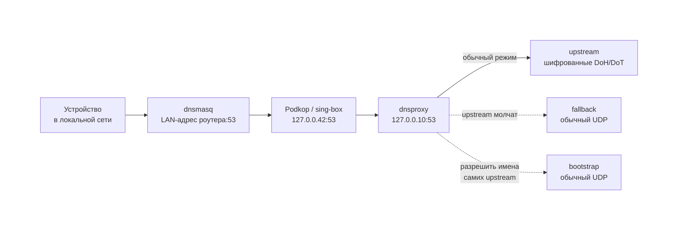

# Podkop Subscriptions

Дополнение к [Podkop](https://github.com/itdoginfo/podkop) для OpenWrt. Берёт ключи из HTTP/HTTPS-подписок, отсеивает лишние и нерабочие, проверяет на совместимость с Podkop/sing-box и записывает готовый список в выбранную секцию `/etc/config/podkop`. Работает и с [Tachyon](https://github.com/Dushnilin/tachyon).

Главный принцип: **не сломать рабочую конфигурацию.** Если подписка не загрузилась, пришла пустой или с битыми ключами, текущая секция Podkop остаётся как была.

[English version](README.md) · [Изменения по версиям](CHANGELOG.md)

<details>
<summary><b>Что умеет</b></summary>

- читает подписки в виде списка ссылок, base64 и JSON (объекты Clash/Mihomo и конфиги Xray);
- запрашивает подписки с отпечатком настоящего мобильного клиента и сам подбирает профиль, на который панель отдаёт больше узлов;
- распознаёт заглушки и узлы-пустышки, которыми панель сообщает об отказе;
- понимает `vless://`, `trojan://`, `ss://`, `socks4://`, `socks4a://`, `socks5://`, `hy2://`, `hysteria2://`;
- проверяет ключи Python-валидатором и `sing-box check` **до** записи в Podkop и не трогает рабочую секцию, если годных ключей не осталось;
- фильтрует ключи регулярным выражением, схлопывает SNI-ротации и дубликаты `IP/домен:порт`, разворачивает домен узла в отдельные ключи по его IP;
- ограничивает число ключей, отсекает ключи с высоким ping и вычищает те, что долго не работают;
- держит защищённый список своих ключей;
- работает и без LuCI, через SSH и cron; расписание применяется само после Apply в LuCI;
- догоняет пропущенное обновление после простоя роутера;
- защищает все пути запуска общей блокировкой.

</details>

## Установка

Интерактивный установщик спросит про веб-панель LuCI и про создание конфига:

```sh
wget -O /tmp/podkop-sub-install.sh https://raw.githubusercontent.com/makxis/podkop-subscriptions/main/install.sh && sh /tmp/podkop-sub-install.sh
```

Без вопросов, с веб-панелью (рекомендуется, если не уверены):

```sh
wget -O /tmp/podkop-sub-install.sh https://raw.githubusercontent.com/makxis/podkop-subscriptions/main/install.sh && sh /tmp/podkop-sub-install.sh --remote --with-panel --no-config
```

С флагом `--no-config` конфиг не пересоздаётся: если его нет, создаётся отключённый пример, который потом настраивается в LuCI.

## Первая настройка

1. **Подготовьте секцию в Podkop.** Ключи записываются в уже существующую секцию `/etc/config/podkop`, поэтому сначала создайте её в самом Podkop.
2. **Укажите подписки.** LuCI → **Services → Подписки Podkop**: включите группу, выберите целевую секцию, добавьте URL подписок и, если нужно автообновление, включите его в блоке «Расписание обновлений». Нажмите **Save & Apply**. Это только сохраняет настройки, ключи ещё не подтягиваются.
3. **Подтяните ключи в первый раз** командой из раздела [Обновить ключи сейчас](#обновить-ключи-сейчас) или кнопкой **Запустить updater** внизу страницы. В первый раз удобнее команда: весь лог сразу в терминале, и видно, доступны ли источники, не режет ли лишнего фильтр и сколько ключей дошло до Podkop.
4. **Проверьте результат:**

   ```sh
   /usr/bin/podkop-sub-updater.py --status-summary
   ```

   Нормальная строка состояния:

   ```text
   Состояние: OK — обновлено: 2026-05-31 23:49, источники: 3/3, ключей в секции: 75,
   рабочих: нет данных, удалено: 0, локальных: 2, автообновление: включено.
   ```

5. **Уберите временные файлы установки:**

   ```sh
   /usr/bin/podkop-sub-clean-temp
   ```

   Удаляются скачанные архивы, распакованные каталоги и кэш LuCI. Конфиги, свои ключи, `state.json`, бэкапы и лог последнего запуска остаются.

<details>
<summary><b>Настройка через SSH, без панели</b></summary>

Правится тот же конфиг:

```sh
vi /etc/config/podkop_subscriptions
uci commit podkop_subscriptions && reload_config
```

`reload_config` обязателен: без него настройки сохранятся, но новое расписание в cron не попадёт.

Минимальный рабочий конфиг:

```text
config subscription_group 'main'
    option enabled '1'
    option target_section 'main'
    list source 'https://example.com/subscription'
    option use_local_links '1'
    option regex ''
    option match_mode 'ifnotmatch'
    option on_empty 'skip'
    option proxy_type 'urltest'
    option max_links '50'
    option max_latency_ms '500'
    option force_cleanup '0'
    option dedupe_sni_rotation '1'
    option dedupe_endpoint_host '0'

config subscription_schedule 'main_0310'
    option enabled '1'
    option hour '3'
    option minute '10'
    option jitter '1800'
    option force '0'
```

Все опции описаны в [справочнике](#справочник), в блоке «Конфигурация».

</details>

## Обновить ключи сейчас

```sh
/usr/bin/podkop-sub-updater.py --subs /etc/config/podkop_subscriptions --config /etc/config/podkop --force
```

Полный цикл: скачать подписки, отфильтровать, проверить и записать ключи в Podkop. Весь лог печатается прямо в терминал, команда ждёт завершения и возвращает код выхода. Это основной инструмент и для первой настройки, и для разбора любых проблем.

<details>
<summary><b>Пример вывода и как его читать</b></summary>

```text
[INFO] === ЗАПУСК ОБНОВЛЕНИЯ ПОДПИСОК ===
[INFO] Профиль запроса подписок: v2raytun/android, Android, Android 11, OnePlus MT2110; ...
[INFO] источник 1: попытка 1/3, лимит 45s, на соединение 15s
[INFO] [main]: источник 1 (base64) -> ссылок после фильтра: 96
[INFO] [main]: Дубликатов в новых ссылках подписки отброшено: 4
[INFO] [main]: Итого уникальных новых ссылок из внешних подписок: 92
[INFO] [main]: для совместимости с Podkop добавлен type=tcp в ключах: 4
[INFO] [main]: проверка совместимости Podkop/sing-box: принято 75, отброшено 0, sing-box check запусков: 2
[INFO] [main]: limit max_links=50, current=48, new_candidates=75, potential=80
[INFO] [main]: итог: добавлено=6, удалено=2, дубликатов в текущем конфиге=0, ключей итого=50
[INFO] Успешно завершено: конфиг обновлён, Podkop перезапущен.
```

По этим строкам видно, где теряются ключи: на загрузке источника, на regex-фильтре, на дедупликации, на проверке совместимости или на лимите `max_links`.

Ссылки на подписки и сами ключи в выводе заменены на `<remote-url>` и `<proxy-link>`, параметры вроде `sni=`, `uuid=`, `password=` на `<hidden>`. Источники называются «источник 1», «источник 2» и «локальный список». Лог можно показывать и прикладывать к issue как есть.

`/usr/bin/podkop-sub-run-now` делает тот же цикл в фоне и пишет лог в `/tmp/podkop-sub-updater.log`. Он нужен кнопке **Запустить updater** в LuCI, чтобы показать результат. Из консоли проще синхронная команда выше: вывод фонового запуска пришлось бы догонять через `tail -f`.

</details>

## Обновить программу

```sh
wget -O /tmp/podkop-sub-upgrade.sh https://raw.githubusercontent.com/makxis/podkop-subscriptions/main/install.sh && sh /tmp/podkop-sub-upgrade.sh --remote --with-panel --no-config && /usr/bin/podkop-sub-clean-temp
```

Конфиг подписок, свои ключи и `state.json` не трогаются. Панель обновляется так же, как была поставлена: скрытая остаётся скрытой, видимая видимой. Показать скрытую панель можно только явно, флагом `--with-panel-visible`.

## Удалить

```sh
wget -O /tmp/podkop-sub-uninstall.sh https://raw.githubusercontent.com/makxis/podkop-subscriptions/main/uninstall.sh && sh /tmp/podkop-sub-uninstall.sh
```

Удаляет скрипты, страницу LuCI, procd-триггер и строки cron. Конфиги, накопленное состояние и ключи, уже записанные в секции Podkop, остаются на месте. Чтобы стереть и настройки (`/etc/config/podkop_subscriptions` и весь каталог `/etc/podkop-subscriptions/` вместе со своими ключами), добавьте `--purge-config`:

```sh
sh /tmp/podkop-sub-uninstall.sh --purge-config
```

## DNS через dnsproxy (необязательно)

Отдельный скрипт, к подпискам прямого отношения не имеющий. Ставит AdGuard dnsproxy на `127.0.0.10:53`: DNS-запросы уходят в зашифрованном виде сразу на несколько независимых DoH-серверов и берётся первый ответ, а если все они недоступны, запрос идёт на обычные DNS. Конфиг намеренно лёгкий: без HTTP/3 и собственного кеша dnsproxy занимает единицы мегабайт памяти.

У скрипта своя нумерация версий. Установленную версию он печатает в конце работы, строкой `Версия установщика: 1.9.0`.

```sh
wget -O /tmp/install-dnsproxy.sh https://raw.githubusercontent.com/makxis/podkop-subscriptions/main/install-dnsproxy.sh && sh /tmp/install-dnsproxy.sh
```

Установка и сразу тест upstream-серверов одной командой:

```sh
wget -O /tmp/install-dnsproxy.sh https://raw.githubusercontent.com/makxis/podkop-subscriptions/main/install-dnsproxy.sh && sh /tmp/install-dnsproxy.sh --test-servers
```

- **Повторный запуск безопасен** и переводит на актуальную конфигурацию роутер, настроенный старой версией скрипта. Ранее подобранные серверы и пресеты LuCI сохраняются. Если проверка в конце не прошла, скрипт сам возвращает всё как было.
- **Podkop скрипт не трогает**, пока не указан флаг `--configure-podkop`. Вручную: в настройках Podkop тип DNS `udp`, сервер `127.0.0.10` без порта (с портом диагностика Podkop сообщает об ошибке).
- **Подобрать серверы под свою сеть** можно отдельно, в любой момент. Нужен терминал: в конце тест покажет два списка и спросит, применить ли их.

  ```sh
  wget -O /tmp/test-doh.sh https://raw.githubusercontent.com/makxis/podkop-subscriptions/main/test-doh.sh && wget -O /tmp/servers.txt https://raw.githubusercontent.com/makxis/podkop-subscriptions/main/servers.txt && sh /tmp/test-doh.sh
  ```

<details>
<summary><b>Флаги install-dnsproxy.sh</b></summary>

| Флаг | Что делает |
|---|---|
| `--configure-podkop` | Направить DNS Podkop на dnsproxy автоматически. По умолчанию `/etc/config/podkop` не изменяется. |
| `--no-podkop-restart` | С `--configure-podkop`: настроить Podkop, но не перезапускать его. |
| `--no-podkop` | Ничего не делать с Podkop. Это поведение по умолчанию, флаг оставлен для совместимости. |
| `--test-servers` | После установки проверить серверы из `servers.txt` через `test-doh.sh`. |
| `--servers-list PATH` | С `--test-servers`: свой список вместо `servers.txt`. |
| `--reset-servers` | Не сохранять ранее подобранные upstream, записать список по умолчанию. |
| `--no-isp-dns` | Не добавлять DNS провайдера в bootstrap и fallback. |
| `--config-only` | Не ставить пакеты, только записать конфиг. |
| `--no-luci` | Не ставить `luci-app-dnsproxy`. |
| `--release 24.10` | Явно указать ветку Fantastic Packages. |
| `--arch x86_64` | Каталог архитектуры Fantastic Packages, откуда брать `luci-app-dnsproxy`. На сам dnsproxy не влияет. |

</details>

<details>
<summary><b>Что именно настраивает установщик</b></summary>

- **Лёгкий конфиг.** Выключены HTTP/3, собственный кеш dnsproxy и optimistic cache (кеширует уже dnsmasq), DNS64, EDNS Client Subnet, подробный лог, обработка hosts, private reverse DNS и локальный DoH/DoT-сервер. На роутере с 256 МБ RAM dnsproxy с HTTP/3 и кешем разрастался примерно до 60 МБ, без них держится в единицах мегабайт.
- **Таймаут upstream 5 с** вместо 10. Когда связь пропадает, каждый запрос висит в dnsproxy таймаут upstream и ещё таймаут fallback, и висящие запросы копятся в памяти. Ответ позже 5 секунд клиенты всё равно уже не ждут.
- **Upstream** работают в режиме `parallel`. При первой установке это Cloudflare, ControlD, Quad9 и AdGuard. При повторном запуске сохраняются уже подобранные, включая правила вида `[/домен/]адрес`; флаг `--reset-servers` возвращает список по умолчанию.
- **Bootstrap и fallback** собираются заново при каждом запуске: обычные DNS из `servers.txt` опрашиваются с самого роутера, и записываются четыре ответивших адреса разных операторов. В конец добавляются DNS провайдера, без проверки (`--no-isp-dns` это отключает).
- **Чужие секции конфига сохраняются**, например пресеты новых версий `luci-app-dnsproxy` (`config profile 'preset_…'`). Собранный конфиг перед заменой рабочего проверяется самим `uci`.
- **В конце печатаются** командная строка и память запущенного dnsproxy. Сразу после старта ориентир: единицы мегабайт RSS. Если со временем память стабильно растёт до 50–100 МБ, это повод разбираться в утечке, а не добавлять swap.
- **`luci-app-trafficctl` удаляется, если включён SQM**: его HTB/IFB-шейпинг поверх SQM/CAKE ограничивал трафик второй раз. Без SQM пакет остаётся, скрипт только предупреждает.
- **Веб-интерфейс** `luci-app-dnsproxy` ставится последним, когда DNS уже настроен и проверен, и только если его ещё нет. Его неудача остаётся предупреждением: DNS работает и без панели. Для x86 дополнительно проверяется каталог `x86_64` Fantastic Packages, потому что пакет собран как `_all` и от архитектуры не зависит.
- Работает и на opkg (OpenWrt 24.10 и старше), и на apk (25.12 и новее). Ветка и архитектура берутся из `/etc/openwrt_release`; если автоопределение не сработало, задайте их флагами `--release` и `--arch`.

</details>

<details>
<summary><b>Проверка, откат и повторный запуск</b></summary>

После записи конфига скрипт ждёт, пока dnsproxy ответит на своём адресе, а в самом конце проверяет, что обычное разрешение имён на роутере не пострадало. Вторая проверка делается, только если имена разрешались до установки: иначе упавший WAN выглядел бы как поломка от скрипта. Если проверка не прошла, установка откатывается целиком.

Откат выполняет готовый скрипт `rollback.sh`, который пишется в каталог бэкапа `/root/dnsproxy-backup-<дата>` **до** первых изменений. В нём уже подставлены прежний конфиг dnsproxy, прежние DNS-настройки Podkop и то, был ли dnsproxy установлен и включён. Поэтому его можно запустить руками и позже. Откат к состоянию перед последним запуском:

```sh
sh "$(ls -d /root/dnsproxy-backup-* | tail -n 1)/rollback.sh"
```

Каждый запуск делает свой бэкап, так что самый ранний каталог хранит исходный конфиг.

Одновременно работает только один экземпляр, за этим следит `/tmp/install-dnsproxy.lock`. Если запустить скрипт, пока предыдущий ещё идёт (например, после обрыва SSH), в терминале он спросит, убить старый запуск или досмотреть его вывод из `/tmp/install-dnsproxy.log`. Без терминала присоединяется, а не убивает. Лок от аварийно завершившегося запуска снимается сам. Ctrl-C завершает запуск, и если что-то успело измениться, скрипт напишет команду отката.

</details>

<details>
<summary><b>Как test-doh.sh выбирает серверы</b></summary>

- **Кандидаты** берутся из `servers.txt`, одна строка на сервер: `АДРЕС [ОПЕРАТОР]`. URL (`https://`, `tls://`, `quic://`) идёт в кандидаты Upstream DNS Server, голый IPv4 в кандидаты Bootstrap и Fallback DNS Server. Без метки оператором считается домен второго уровня, а для IP сам адрес.
- **Порядок проверки.** Сначала обычные DNS, затем DoH. Лучшие обычные DNS вместе с DNS провайдера служат bootstrap для проверки DoH, поэтому если провайдер режет часть публичных DNS по 53 порту, DoH-серверы всё равно проверяются честно, а не падают на разрешении собственного имени.
- **Оценка.** Сервер должен ответить на три домена (`github.com`, `raw.githubusercontent.com`, `release-assets.githubusercontent.com`), каждый не дольше чем за 1000 мс (`--timeout-ms`). 3/3 означает GOOD. После первой неудачи сервер дальше не опрашивается: 3/3 он уже не наберёт.
- **Выбор.** В Upstream до пяти DoH по задержке, в Bootstrap и Fallback до четырёх обычных DNS, к ним в конец DNS провайдера без проверки. Сначала берётся лучший сервер каждого оператора и только потом вторые адреса тех же: пять адресов Cloudflare не дают пяти независимых upstream.
- **Применение.** Только в терминале и только по ответу `y` или `д`. Список, где никто не набрал 3/3, остаётся прежним, правила `[/домен/]адрес` в upstream сохраняются. Перед записью конфиг копируется в `/root/dnsproxy-servers-backup-<дата>.config`, после перезапуска dnsproxy проверяется ответом на `openwrt.org`, и если ответа нет, всё возвращается.
- **Нагрузка.** Серверы проверяются по одному, тестовый dnsproxy (на `127.0.0.11`) одновременно запущен максимум один, ожидание идёт на таймауте самого `nslookup`, без циклов опроса. Нужны только `dnsproxy` и `nslookup`, Python не нужен.

Родительских (family) фильтров в списке нет: в режиме `parallel` побеждает самый быстрый ответ, и фильтр 18+ блокировал бы сайты случайным образом. Из России Яндекс почти всегда быстрее всех и будет отвечать на большинство запросов. Если нужны только зарубежные upstream, удалите его строки из `servers.txt`.

</details>

<details>
<summary><b>Как идёт DNS-запрос и зачем три списка серверов</b></summary>


```mermaid
%%{init: {"flowchart": {"diagramPadding": 90}}}%%
flowchart LR
    C["Устройство<br/>в локальной сети"] --> D["dnsmasq<br/>LAN-адрес роутера:53"]
    D --> P["Podkop / sing-box<br/>127.0.0.42:53"]
    P --> X["dnsproxy<br/>127.0.0.10:53"]
    X -->|"обычный режим"| U["upstream<br/>шифрованные DoH/DoT"]
    X -.->|"upstream молчат"| F["fallback<br/>обычный UDP"]
    X -.->|"разрешить имена<br/>самих upstream"| B["bootstrap<br/>обычный UDP"]
```

Для доменов, которые Podkop заворачивает в прокси, он отвечает fake-IP из диапазона `198.18.0.0/15`. Поэтому в локальной сети такие домены резолвятся в `198.18.x.x`, и это нормально.

Списки серверов живут в `/etc/config/dnsproxy`, секция `servers`, и решают три разные задачи:

| Список | Когда используется | Чем заполнять |
|---|---|---|
| `upstream` | Всегда, это основной путь | Только шифрованные DoH/DoT. Отвечает за приватность |
| `bootstrap` | Чтобы узнать IP самих `upstream` по их доменному имени | Обычные IP. Без него шифрованные адреса не с кого разрешить |
| `fallback` | Если ни один `upstream` не ответил | Обычные IP. Отвечает за живучесть, а не за приватность |

`upstream` работает в режиме `parallel`: запрос уходит во все серверы разом, берётся первый ответ. Один медленный сервер в списке ничего не портит, а недоступный просто никогда не выигрывает гонку.

`fallback` нужен ровно для случая, когда шифрованные адреса недоступны, поэтому требовать от него шифрования бессмысленно. Цена в том, что эти запросы уходят открытым текстом.

`bootstrap` легко упустить. Если он состоит только из адресов, которые могут оказаться недоступны, `upstream` не поднимутся не потому, что заблокированы сами, а потому, что их имена некому разрешить. Поэтому установщик не берёт оба списка из головы, а проверяет кандидатов с самого роутера.

Порядок в `bootstrap` и `fallback` приоритетом не служит: dnsproxy опрашивает все адреса разом и берёт первый ответ. Отсюда и короткие списки: когда upstream недоступны, каждый запрос держит в dnsproxy по горутине на каждый адрес fallback.

</details>

<details>
<summary><b>Проверить сервер вручную</b></summary>

Поднимите временный экземпляр рядом с рабочим:

```sh
dnsproxy --listen 127.0.0.1 --port 15353 \
         --upstream https://dns.quad9.net/dns-query \
         --bootstrap 8.8.4.4 --timeout 5s &
nslookup -port=15353 openwrt.org 127.0.0.1
```

Смотреть стоит не только на среднее время, но и на долю ответов: резолвер, который отвечает на треть запросов, хуже медленного, но стабильного. Порт `15353` выбран произвольно, рабочий dnsproxy на `127.0.0.10:53` не затрагивается.

Правки вносятся через `uci` и применяются перезапуском:

```sh
uci -q del dnsproxy.servers.upstream
uci add_list dnsproxy.servers.upstream='https://dns.cloudflare.com/dns-query'
uci add_list dnsproxy.servers.upstream='https://dns.quad9.net/dns-query'
uci commit dnsproxy
/etc/init.d/dnsproxy restart
```

</details>

## Если что-то не так

**Ключи не появились в Podkop.** Запустите обновление синхронно и прочитайте вывод:

```sh
/usr/bin/podkop-sub-updater.py --subs /etc/config/podkop_subscriptions --config /etc/config/podkop --force
```

**В логе `отброшено 0`, но ключей мало.** Валидатор ни при чём, ищите причину в `regex`, `dedupe_*`, `max_links`, `max_latency_ms` или `force_cleanup`.

**Обновления не идут по расписанию.** В статусе `автообновление: не применено`, значит cron не синхронизирован:

```sh
/usr/bin/podkop-sub-cron-sync
grep -E 'podkop-sub-health|podkop-sub-updater|podkop-sub-catchup' /etc/crontabs/root
```

**Updater завис или всё время «выполняется».** Проверьте состояние и блокировки:

```sh
/usr/bin/podkop-sub-run-now --status
ls -la /tmp/podkop-sub-updater.lock /tmp/podkop-sub-updater.flock
```

Код выхода `75` означает, что блокировка была занята дольше 300 секунд.

**Страница LuCI не открывается после установки.** Сбросьте кэш:

```sh
/usr/bin/podkop-sub-clean-temp
/etc/init.d/rpcd restart
/etc/init.d/uhttpd restart
```

**После обновления панель пишет «Ошибка сохранения: Доступ запрещён» или ведёт себя странно.** Скорее всего, браузер исполняет старый JavaScript из своего кеша. Обновите страницу с Ctrl+Shift+R и войдите в LuCI заново: установщик перезапускает rpcd, и старая сессия сбрасывается.

**dnsproxy занимает много памяти.** Запустите установщик dnsproxy ещё раз: он переведёт роутер на лёгкую конфигурацию и в конце покажет, сколько памяти занимает процесс.

**После установки dnsproxy пропал DNS.** Верните состояние перед последним запуском:

```sh
sh "$(ls -d /root/dnsproxy-backup-* | tail -n 1)/rollback.sh"
```

## Справочник

Подробности, которые не нужны для установки и повседневной работы.

<details>
<summary><b>Все команды</b></summary>

**Ежедневные**

| Команда | Что делает |
|---|---|
| `/usr/bin/podkop-sub-updater.py --subs /etc/config/podkop_subscriptions --config /etc/config/podkop --force` | **Обновить ключи сейчас.** Полный цикл (загрузка → фильтр → валидация → запись в Podkop) синхронно, весь лог в терминал, на выходе код возврата. |
| `/usr/bin/podkop-sub-run-now` | То же самое в фоне, с записью в `/tmp/podkop-sub-updater.log`. Нужно кнопке в LuCI. Если updater уже работает, запуск тихо пропускается. |
| `/usr/bin/podkop-sub-run-now --status` | Состояние фонового запуска: `running`, `finished` или `idle`, плюс хвост лога. |
| `/usr/bin/podkop-sub-run-now --version` | Установленная версия. |
| `/usr/bin/podkop-sub-updater.py --status-summary` | Однострочный статус: время обновления, источники, число ключей, состояние автообновления. |
| `/usr/bin/podkop-sub-updater.py --fail-count` | Накопленные `fail_count` по ключам. Сами ключи не печатаются, вывод можно показывать кому угодно. |

**Установка и обновление**

| Команда | Что делает |
|---|---|
| `sh install.sh` | Интерактивная установка: спрашивает про панель LuCI и про конфиг. |
| `sh install.sh --with-panel` | Поставить панель LuCI. Если она уже стоит скрытой, такой и останется. |
| `sh install.sh --with-panel-visible` | Поставить панель и показать её в меню, даже если до этого она была скрыта. |
| `sh install.sh --with-panel-hidden` | Поставить файлы панели, но не добавлять пункт в меню. |
| `sh install.sh --no-panel` (`--core-only`) | Только ядро, без LuCI. Управление через SSH и cron. |
| `sh install.sh --configure` | Создать или пересоздать `/etc/config/podkop_subscriptions` без вопросов. |
| `sh install.sh --no-config` | Не трогать существующий конфиг. Обязательно при обновлении поверх. |
| `sh install.sh --remote` | Брать файлы с GitHub (для одиночного `install.sh` в `/tmp`). |
| `sh install.sh --local` | Брать файлы из каталога рядом со скриптом (для клона репозитория). |
| `sh install.sh --repo=owner/repo` | Установить из форка. |
| `sh install.sh --branch=main` | Установить из другой ветки. |
| `sh install.sh --raw-base=URL` | Свой базовый URL вместо raw.githubusercontent.com. |
| `sh podkop-sub-upgrade` | Обновление из локального клона репозитория, короткая запись `sh install.sh --local --with-panel --no-config`. Скрипт живёт в репозитории и **не** копируется в `/usr/bin`. |
| `/usr/bin/podkop-sub-clean-temp` | Удалить временные файлы установки и кэш LuCI. Настройки, ключи, состояние, бэкапы и лог не трогает. |

**Диагностика и обслуживание**

| Команда | Что делает |
|---|---|
| `/usr/bin/podkop-sub-updater.py --version` | Версия updater. |
| `/usr/bin/podkop-sub-updater.py --observe-only --config /etc/config/podkop` | Только наблюдение: обновляет `fail_count` по данным Podkop URLTest, конфиг не меняет. Запускается по cron раз в час. |
| `/usr/bin/podkop-sub-updater.py --catch-up ...` | Обновить подписки, если последнее успешное обновление старше 24 часов. Запускается из `/etc/init.d/podkop_subscriptions` через 5 минут после загрузки роутера. |
| `/usr/bin/podkop-sub-updater.py --catch-up-retry ...` | Повторить catch-up, только если предыдущий завершился ошибкой. Стоит в cron каждые 30 минут. |
| `/usr/bin/podkop-sub-cron-sync` | Пересобрать строки в `/etc/crontabs/root` по текущему конфигу и вывести результат. В норме вызывается автоматически, вручную нужен для диагностики. |

**Флаги updater**

| Флаг | По умолчанию | Смысл |
|---|---|---|
| `--config PATH` | `/etc/config/podkop` | Путь к конфигу Podkop. |
| `--subs PATH` | `/etc/config/podkop_subscriptions` | Путь к конфигу подписок. |
| `--state PATH` | `/etc/podkop-subscriptions/state.json` | Путь к файлу состояния. |
| `--force` | выкл. | Перезаписать секцию Podkop и перезапустить сервис, даже если содержимое не изменилось. |
| `--delete-after-fails N` | `72` | Удалять ключ после N неудачных наблюдений подряд (при ежечасном наблюдателе это примерно трое суток). |
| `--min-keep N` | `1` | Минимум ключей, который нельзя вычищать из секции. |

</details>

<details>
<summary><b>Конфигурация: все опции</b></summary>

Всё настраивается в `/etc/config/podkop_subscriptions`, через LuCI или напрямую. Минимальный рабочий конфиг приведён выше, в блоке «Настройка через SSH, без панели».

**`config subscription_group`**

| Опция | По умолчанию | Назначение |
|---|---|---|
| `enabled` | `1` | `0`: группа полностью игнорируется. |
| `target_section` | имя секции | В какую секцию `/etc/config/podkop` писать ключи. Несколько групп могут писать в одну секцию, их результаты объединяются. |
| `source` (list) | | URL подписки. Строк может быть несколько: это резервирование, а не дублирование. |
| `use_local_links` | `0` | `1`: добавить свои ключи из `/etc/podkop-subscriptions/local-links`. |
| `regex` | пусто | Фильтр по proxy-ссылке. Пусто означает без фильтрации. |
| `match_mode` | `ifnotmatch` | `ifmatch` оставляет только совпавшие, `ifnotmatch` исключает совпавшие. |
| `on_empty` | `skip` | Если после фильтра из источника ничего не осталось: `skip` пропускает источник, `all` берёт все ссылки без фильтра. |
| `proxy_type` | `urltest` | Тип секции Podkop: `urltest` или `selector`. |
| `max_links` | `0` | Максимум ключей в секции. `0` или пусто означает без ограничения. |
| `max_latency_ms` | `0` | Удалять ключи с ping выше лимита по данным Podkop URLTest. `0` или пусто: не удалять по ping. |
| `force_cleanup` | `0` | `1`: чистить ключи с `fail_count >= 2` и превышением ping, даже когда лимит `max_links` не достигнут. |
| `dedupe_sni_rotation` | `0` | `1`: считать ключи, отличающиеся только `sni`, одним ключом. |
| `dedupe_endpoint_host` | `0` | `1`: схлопывать ключи с одинаковым `IP/домен:порт`. |
| `expand_domain_ips` | `1` | Домен с несколькими адресами разворачивается в отдельный ключ на каждый IP, доменный ключ остаётся. `0` выключает. |
| `fingerprint` | пусто | Профиль отпечатка для этой группы. Пусто означает профиль `default`. |
| `fingerprint_probe_days` | `7` | Как часто перезамерять, какой профиль даёт больше узлов. `0`: замерить один раз и больше не трогать. |

Если несколько групп пишут в одну секцию, числовые лимиты берутся минимальные из заданных, а флаги (`force_cleanup`, оба `dedupe_*`) включаются, если включены хотя бы в одной группе.

**`config subscription_schedule`**

| Опция | Назначение |
|---|---|
| `enabled` | `0`: расписание не попадает в cron. |
| `hour` | Час запуска (0–23). |
| `minute` | Минута запуска (0–59). |
| `jitter` | Случайная задержка перед запуском в секундах. `1800` означает до 30 минут, `0` без задержки. Нужна, чтобы не бить по серверу подписки одновременно со всеми. |
| `force` | `1`: добавить `--force`, то есть перезаписывать секцию и перезапускать Podkop даже без изменений. |

Расписаний может быть несколько, например ночное и дневное.

</details>

<details>
<summary><b>Как обрабатываются ключи</b></summary>

```text
скачать подписки
→ извлечь proxy-ссылки (plain-text или base64)
→ применить regex
→ удалить дубликаты
→ нормализовать type=tcp для vless/trojan без type
→ Python-проверка формата
→ sing-box check на временном конфиге
→ дедупликация SNI / endpoint
→ применить лимиты, ping и fail_count
→ записать в Podkop
```

Это **не** ping и не проверка скорости, а защита от кривых ссылок, способных положить генерацию sing-box-конфига. Если после проверки совместимых ключей не осталось, текущая секция Podkop не перезаписывается.

Строка в логе:

```text
[main]: проверка совместимости Podkop/sing-box: принято 75, отброшено 0, sing-box check запусков: 2
```

`отброшено 0` означает, что валидатор и `sing-box check` ключи не резали: значит, ключи потерялись на regex, дедупликации, лимитах или принудительной чистке. Какой ключ и на каком значении отвалился, видно в логе на уровне DEBUG:

```text
[x2x]: ключ не для Podkop (🇳🇱 Нидерланды): transport не поддерживается Podkop: xhttp
```

**Почему проверок две.** Они отвечают на разные вопросы, и первая не слабее второй.

Ссылку в outbound превращает **сам Podkop**, конвертером `/usr/lib/podkop/sing_box_config_facade.sh`. Потолок возможностей задаёт он, а не sing-box: даже то, что sing-box умеет, бесполезно, если Podkop не умеет это собрать. Поэтому первая проверка повторяет ровно его `case`-ы: по схеме, по `security` и по `type`. Что происходит без неё, проверено на роутере:

| Ссылка | Podkop | `sing-box check` |
|---|---|---|
| `type=xhttp`, `type=httpupgrade` | пишет в лог `Unknown transport 'xhttp' detected.` и собирает outbound **без транспорта**, то есть обычный TCP | проходит успешно |
| `vmess://`, `tuic://` | `Unsupported proxy vmess type. Aborted.` и выход с ошибкой | проверять нечего |

В первом случае ключ молча превращается в нерабочий узел, который честно висит в URLTest, а конфиг при этом валиден и вторую проверку проходит. Во втором один такой ключ оставляет роутер вообще без proxy. Поймать оба случая можно только до конвертации.

Вторая проверка ловит то, что до конвертации не видно: неизвестный метод шифрования у shadowsocks, reality без uTLS и прочее, что вылезает при разборе готового конфига. Заодно первая проверка и строит конфиг для второй: `sing-box check` читает JSON, а не ссылки.

</details>

<details>
<summary><b>Regex-фильтр</b></summary>

Фильтр применяется ко **всей** proxy-ссылке после декодирования percent-encoded символов. Регистр не важен: `YouTube`, `youtube` и `YOUTUBE` одно и то же.

```text
match_mode = ifmatch     # оставить только совпавшие
match_mode = ifnotmatch  # исключить совпавшие
```

Для исключающего фильтра почти всегда нужна пара `match_mode = ifnotmatch` и `on_empty = skip`.

Пример: исключить `xhttp` в любом месте ссылки, а остальные слова искать только в названии ключа (после `#`):

```text
xhttp|#.*(YouTube|youtube|Ютуб|ютуб|YT|без рекламы|Messengers|MultiIP|Белый|список|Россия|Финляндия|🇦🇺|🇫🇮|\bAI\b)
```

```text
xhttp      совпадает в любом месте proxy-ссылки;
#.*(...)   всё в скобках ищется только после решётки, то есть в названии ключа;
\bAI\b     AI только отдельным словом, чтобы не задеть Premium+Main;
YouTube    нужен отдельно: YT не совпадает с YouTube.
```

Точки в IP-адресах экранируйте: `107\.150\.93\.`

Проверка после изменения фильтра:

```sh
/usr/bin/podkop-sub-updater.py --subs /etc/config/podkop_subscriptions --config /etc/config/podkop --force
grep -nE "Premium|LTE|YouTube|Финляндия|YT" /etc/config/podkop
```

Некорректное регулярное выражение не роняет обновление: источник пропускается с `ERROR` в логе.

</details>

<details>
<summary><b>Свои ключи (local-links)</b></summary>

```sh
vi /etc/podkop-subscriptions/local-links
```

Один ключ на строку:

```text
vless://...
trojan://...
ss://...
```

Подключаются к группе опцией `option use_local_links '1'`.

Свои ключи не удаляются автоматической чисткой и не заменяются при схлопывании SNI- и IP-дубликатов. В статистике они **не** считаются сетевым источником: не увеличивают счётчик успешных подписок и не маскируют проблемы с загрузкой внешних URL.

До версии 3.6.3 файл лежал в `/etc/config/podkop-local-links` и ломал UCI: всё в `/etc/config` разбирается как UCI, а простой список ссылок им не является. Установщик переносит файл на новое место сам, а updater читает старый путь, если новый ещё не создан.

</details>

<details>
<summary><b>Дедупликация, лимиты и fail_count</b></summary>

**SNI-ротации, `dedupe_sni_rotation`.** Если новый ключ отличается от старого только параметром `sni`, старый вариант заменяется новым.

**`IP/домен:порт`, `dedupe_endpoint_host`.** Сравнивается адрес сервера **вместе с портом**. Один хост на разных портах считается разными рабочими вариантами, и они друг друга не вытесняют:

```text
server.example.com:443     ← разные ключи,
server.example.com:8443    ← оба сохраняются
```

Схлопываются только полностью совпадающие `хост:порт`. `transport`, `sni`, `path`, `fp` и название ключа в сравнении не участвуют, остаётся последний вариант из подписки. Опция выключена по умолчанию: включайте, только если уверены, что несколько ключей на одном хосте действительно ротация, а не разные рабочие варианты.

**Лимиты:**

| Опция | Эффект |
|---|---|
| `max_links '50'` | Максимум ключей в секции. `0` или пусто означает без ограничения. |
| `max_latency_ms '500'` | Удалять ключи с ping выше лимита по данным Podkop URLTest. `0` или пусто: не удалять по ping. |
| `force_cleanup '0'` | `1`: чистить ключи с `fail_count >= 2` и превышением ping, даже когда `max_links` не достигнут. |

`fail_count` накапливает ежечасный наблюдатель (`--observe-only`) по данным Podkop URLTest. Посмотреть накопленное, не печатая сами ключи:

```sh
/usr/bin/podkop-sub-updater.py --fail-count
```

</details>

<details>
<summary><b>Разворачивание доменов в IP</b></summary>

Подписка часто указывает узел доменом, а за ним стоит несколько серверов. Какой из них достанется, решает DNS, и это не обязательно самый быстрый.

Опция `expand_domain_ips` (галочка **Разворачивать домены в IP** в LuCI) для домена с двумя и более адресами добавляет по ключу на каждый IP. Доменный ключ остаётся и продолжит работать, когда адреса сменятся. URLTest в Podkop затем измеряет серверы по отдельности и выбирает лучший.

Подменяется только хост. `sni`, `host` и остальные параметры остаются от домена, иначе TLS и ws-транспорт сломаются. К имени дописывается последний октет адреса, а если он у адресов одинаковый, адрес целиком. Домены с единственным адресом не трогаются. Разворачивание идёт после regex-фильтра, поэтому отсеянные ссылки не стоят DNS-запросов.

Ключей становится заметно больше, так что лимит `max_links` выбирается быстрее.

Опция включена по умолчанию, в том числе для конфигов, где её нет вовсе. Выключается явным `option expand_domain_ips '0'` в группе или снятой галкой в LuCI, и это сохраняется при следующих обновлениях.

</details>

<details>
<summary><b>Отпечаток клиента: какими заголовками запрашиваются подписки</b></summary>

Панели выдачи подписок (Remnawave, Marzban, 3x-ui и подобные) отдают разное содержимое разным клиентам и опознают их по заголовкам запроса: `User-Agent`, `X-HWID`, `X-Device-Model`, `X-App-Version`. Обычному HTTP-клиенту такая панель вернёт усечённый список, заглушку или откажет вовсе.

Поэтому updater ходит за подписками набором заголовков, снятым с настоящего мобильного клиента. Реальную модель роутера и версию ядра он не отправляет. Набор задаётся в конфиге и правится в LuCI:

```text
config fingerprint 'default'
    option enabled '1'
    list header 'User-agent: v2raytun/android'
    list header 'X-HWID: {hwid}'
    list header 'X-Device-OS: Android'
    list header 'X-Ver-OS: Android 11'
    list header 'X-Device-Model: OnePlus MT2110'
    list header 'X-App-Version: 5.25.81'
```

Порядок строк и регистр имён сохраняются как есть: панель смотрит и на то, и на другое. `Host` и `Accept-Encoding` можно не убирать, updater отбросит их сам. Профиль `default` применяется ко всем группам подписок, группа может выбрать другой опцией `fingerprint`.

**X-HWID.** Значение `{hwid}` означает «сгенерировать персональный идентификатор при первом обновлении и записать сюда»: 16 шестнадцатеричных символов из `/dev/urandom`. Дальше значение не меняется, потому что для панели смена `X-HWID` выглядит как новое устройство. Если секции `fingerprint` в конфиге нет вовсе, она создаётся при первом запуске со встроенным набором и собственным HWID.

**Лимит устройств.** Многие панели ограничивают число устройств на подписку и привязывают их по `X-HWID`. Каждый роутер со своим идентификатором занимает отдельный слот. Если лимит мешает, скопируйте сгенерированное значение с первого роутера на остальные, и они будут выглядеть одним устройством.

**Несколько профилей.** Одна панель ждёт v2raytun, другая Happ, и задавать соответствие руками не нужно. При первом чтении источника updater опрашивает каждый профиль и запоминает тот, что дал больше узлов: разница бывает существенной, на одной и той же подписке один клиент получает 27 узлов, другой 30. Обычный прогон обходится одним запросом с запомненным профилем. Перезамер происходит, когда выбора ещё не было, когда профиль исчез из конфига, когда прошёл срок `fingerprint_probe_days` или когда запомненный профиль вдруг дал заметно меньше узлов.

**Отказы запоминаются.** Если панель отказала конкретному профилю, он исключается из будущих замеров на этом источнике: на панели с лимитом устройств сама попытка чужим клиентом занимает слот. Неудачей считается не только ошибка загрузки. Панель, не признавшая клиента, обычно отвечает кодом 200: страницей-заглушкой антибота или фиктивным узлом на `0.0.0.0:1` с причиной в имени, например «Вы достигли максимального числа устройств для вашей подписки». Такие ответы распознаются, причина попадает в лог, а ключи-пустышки в Podkop не записываются.

**Чем отправляется запрос.** При наличии `curl` запрос идёт им: он отправляет заголовки байт в байт и в заданном порядке. Отдельной зависимости это не создаёт, `curl` требуется самому Podkop. Штатный `wget` (это `uclient-fetch`) остаётся запасным путём, но он переписывает `User-Agent` своим написанием и ставит его последним, так что отпечаток получается приблизительным; в логе на этот случай есть предупреждение. Сжатие не запрашивается: libcurl в OpenWrt собран без zlib.

</details>

<details>
<summary><b>Форматы подписок и номер источника в имени ключа</b></summary>

Форматы распознаются автоматически, в таком порядке: base64, прямые ссылки, JSON.

| Формат | Пример источника |
|---|---|
| прямые ссылки по строкам | большинство панелей |
| base64 от такого списка | он же, обычная упаковка |
| JSON с объектами Clash/Mihomo | панели и конвертеры, отдающие список узлов в JSON |
| JSON с полными конфигами Xray | массив конфигов, по одному на узел, имя в `remarks` |

Разбор JSON не требует `python3-yaml`: объекты Clash приходят именно как JSON. Правила сборки ссылки перенесены из зрелой открытой реализации и сверены с её выводом на одних и тех же данных. Если источник умеет отдавать готовые ссылки, лучше просить у него именно их: меньше преобразований, меньше поводов разойтись.

**Номер источника.** К имени каждого ключа из подписки дописывается номер источника в том порядке, в каком они перечислены в группе: `[2] 🇳🇱 Нидерланды`. В списке Podkop сразу видно, откуда приехал узел, а по номеру он соотносится со строками лога «источник 2». Номер обновляется на каждом запуске, поэтому после смены порядка источников ключи получат новые номера, в том числе уже лежащие в секции. Имя не участвует в идентификации ключа (`stable_id` считается по ссылке без части после `#`), так что переименование не создаёт новых ключей и не сбрасывает статистику отказов. Свои ключи из `local-links` номера не получают.

</details>

<details>
<summary><b>Автообновление, cron и catch-up</b></summary>

Расписание в `/etc/config/podkop_subscriptions` это **сохранённая настройка**, а реально выполняется только то, что попало в `/etc/crontabs/root`. Поэтому в статусе есть отдельная метка:

```text
автообновление: включено      расписание задано и применено в cron
автообновление: не применено  расписание есть, но cron ещё не синхронизирован
автообновление: не задано     расписаний в конфиге нет
```

Cron синхронизируется двумя путями: LuCI вызывает `/usr/bin/podkop-sub-cron-sync` сразу после Save или Save & Apply, а procd-триггер `/etc/init.d/podkop_subscriptions` делает то же по системному событию `config.change`.

**При правке через SSH** событие `config.change` посылает не `uci commit`, а `reload_config` (его вызывает и кнопка Apply в LuCI). Голый `uci commit podkop_subscriptions` триггер не поднимает, и cron останется со старым расписанием. Поэтому после ручной правки нужен `uci commit podkop_subscriptions && reload_config` или прямой вызов `/usr/bin/podkop-sub-cron-sync`. Он идемпотентен и использует атомарный `fcntl.flock`, так что повторные и одновременные вызовы безопасны.

Помимо строк из `subscription_schedule` создаются две служебные записи:

```text
0 * * * *    --observe-only     # ежечасный сбор fail_count
*/30 * * * * --catch-up-retry   # повтор, если catch-up не удался
```

Проверить, что всё на месте:

```sh
grep -E 'podkop-sub-health|podkop-sub-updater|podkop-sub-catchup' /etc/crontabs/root
```

**Catch-up после простоя.** Cron не выполняет задания, пропущенные во время выключения. Поэтому через 5 минут после загрузки проверяется возраст последнего успешного обновления; если прошло больше 24 часов, подписки обновляются, а если не вышло, повтор идёт каждые 30 минут до успеха. Запуск после загрузки живёт не в cron, а в `/etc/init.d/podkop_subscriptions`: BusyBox crond не поддерживает `@reboot`. Init-скрипт поднимает procd-инстанс `catchup`, который выжидает 5 минут и один раз запускает updater с `--catch-up`. Его состояние:

```sh
ubus call service list | grep -A 6 podkop_subscriptions
```

Задержка задаётся переменной `BOOT_CATCHUP_DELAY` в начале init-скрипта.

</details>

<details>
<summary><b>Статус, ошибки и параллельные запуски</b></summary>

Подробности в статусе выводятся только при аварии: пустые подписки, неподдерживаемый формат, все ключи отброшены, не удалось записать конфиг.

**Что считается аварией.** Отказ отдельного источника аварией не считается: несколько подписок обычно и держат ради резервирования. Такая ситуация пишется как `WARN`, чтобы LuCI не заваливала интерфейс всплывающими ошибками. Красная ошибка возникает, только если валидных ключей не удалось собрать **ни для одной** секции, и старый рабочий конфиг Podkop при этом не затирается.

**Параллельные запуски.** Все пути запуска updater (плановое обновление, `--observe-only`, catch-up, retry и ручной запуск) используют общий `flock` `/tmp/podkop-sub-updater.flock`:

- `--observe-only` тихо пропускается, если updater уже занят;
- обычное обновление и catch-up ждут освобождения блокировки до 300 секунд;
- если блокировка так и не освободилась, запуск завершается с понятным предупреждением и кодом `75`.

Каталог `/tmp/podkop-sub-updater.lock` в `podkop-sub-run-now` нужен только для отображения состояния ручного запуска в LuCI, реальную защиту обеспечивает `flock` внутри Python-updater.

</details>

<details>
<summary><b>Файлы на роутере</b></summary>

| Путь | Назначение |
|---|---|
| `/etc/config/podkop_subscriptions` | Главный конфиг: группы подписок, источники, фильтры, лимиты, расписание. |
| `/etc/config/podkop` | Родной конфиг Podkop. Updater читает из него секции и пишет туда итоговые ключи. |
| `/etc/podkop-subscriptions/local-links` | Свои ключи, по одному на строку. Защищены от автоматической чистки. |
| `/etc/podkop-subscriptions/state.json` | Служебное состояние: `fail_count`, последний статус, catch-up и retry, недавно удалённые ключи. |
| `/tmp/podkop-sub-updater.log` | Лог последнего ручного запуска (`podkop-sub-run-now` или кнопка в LuCI). |
| `/tmp/podkop-sub-updater.status` | Машиночитаемый статус ручного запуска для LuCI. |
| `/tmp/podkop-sub-updater.flock` | Общая блокировка всех путей запуска updater. |
| `/etc/init.d/podkop_subscriptions` | procd: синхронизирует cron по событию `config.change` и запускает catch-up после загрузки роутера. |
| `/usr/share/podkop-subscriptions/VERSION` | Установленная версия. |

</details>

<details>
<summary><b>Tachyon</b></summary>

С версии 3.8.0 работает и с [Tachyon](https://github.com/Dushnilin/tachyon), форком Podkop Plus, который ставится вместо Podkop. Совместимость неполная, потому что у Tachyon своя схема конфига:

- Если `/etc/config/podkop` нет, а `/etc/config/tachyon` есть, апдейтер сам переключается на Tachyon. Cron, панель и команды из этого README менять не нужно.
- Ключи пишутся в `selector_proxy_links` секции, у секции ставится `action 'connection'`. Поля Podkop (`connection_type`, `proxy_config_type`, `urltest_proxy_links`) туда не пишутся: Tachyon переносит их только при обновлении своего пакета, а до этого секция осталась бы без ключей.
- URLTest в Tachyon задаётся отдельной секцией `config urltest` со ссылкой на целевую секцию. Для `proxy_type 'urltest'` апдейтер создаёт такую группу `Fastest`, если её нет. `proxy_type 'selector'` существующую группу не удаляет: её настройки принадлежат Tachyon.
- Фильтр ключей сверяется с возможностями Tachyon: проходят `http`, `h2`, `httpupgrade`, а `xhttp` только если установленный sing-box его умеет (extended или lx). На обычном sing-box такие ключи отбрасываются с причиной «xhttp не поддерживается установленным sing-box».
- Проверка живости берётся из `tachyon clash_api get_proxies`, после обновления перезапускается `/etc/init.d/tachyon`.
- Собственные подписки Tachyon (`subscription_urls`) не используйте в той же секции: их outbound'ы сдвинут нумерацию `<секция>-N-out`, и health-check начнёт путать ключи.

</details>

## Совместимость

```text
OpenWrt:         24.10.3–24.10.6; 25.12.4
Podkop:          v0.7.17–v0.7.19; v0.7.22
LuCI App Podkop: v0.7.17–v0.7.19; v0.7.22
sing-box:        1.12.17; 1.12.22
```

Tachyon: проверено на 1.4.3 (OpenWrt 24.10.7, sing-box 1.12.22). Апдейтер переключается на него сам, особенности описаны в справочнике.

## Лицензия

См. [LICENSE](LICENSE).
